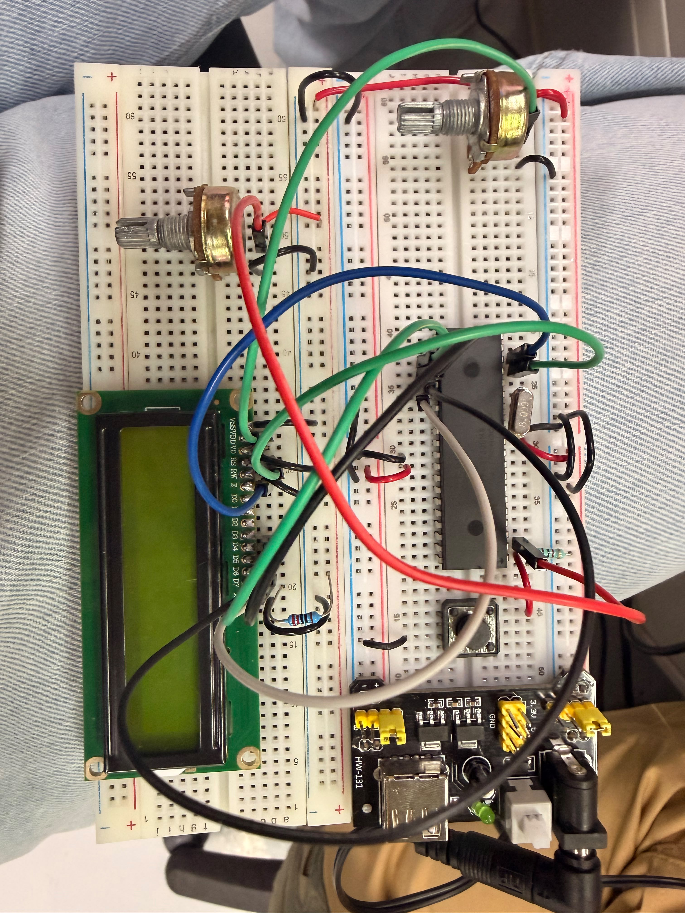

# Actividad 1 — Timer1 con monitoreo de voltaje en LCD

## Descripción

En esta actividad se integró el uso de **Timer1**, el módulo **ADC** y una pantalla **LCD 16x2**. El sistema muestra el voltaje leído desde un potenciómetro conectado a `AN0` y un temporizador en formato `MM:SS`.

---

## Componentes utilizados

- PIC16F887
- Pantalla LCD 16x2
- Potenciómetro
- Potenciómetro para contraste del LCD
- Cristal oscilador
- Botón de reset
- Resistencia para MCLR
- Fuente Vcc
- Tierra GND
- MPLAB X IDE
- Compilador XC8
- Proteus Design Suite
- Librería LCD

---

## Librería utilizada

Para el manejo de la pantalla LCD se utilizó la librería general del repositorio:

- [`lcd.h`](../../Libreria_LCD/lcd.h)
- [`lcd.c`](../../Libreria_LCD/lcd.c)

---

## Evidencias

### Simulación en Proteus

[](./evidencias_fisicas/Timer1volt_fsim.mp4)

## Evidencias físicas

### Armado general del circuito 


### Video de funcionamiento físico 
[](./evidencias_fisicas/Timer1volt_fisico.mp4)

---

## Funcionamiento del programa

El ADC lee el voltaje del potenciómetro conectado a `RA0/AN0`. El valor ADC se convierte a milivolts y se muestra en la primera línea de la LCD.

Timer1 genera interrupciones periódicas para actualizar el tiempo transcurrido, el cual se muestra en la segunda línea de la LCD.

---

## Lógica de programación

El ADC se configura con:

```c
ANSEL = 0x01;
ADCON0 = 0x81;
ADCON1 = 0x80;
```

Timer1 se configura con:

```c
T1CON = 0x31;
TMR1H = 0xF6;
TMR1L = 0x3C;
```

El voltaje se calcula así:

```c
voltaje_mV = ((unsigned long)adc * 5000) / 1023;
```

---

## Código utilizado

```c
#include <xc.h>
#include <stdio.h>
#include <stdlib.h>
#include <stdbool.h>
#include "lcd.h"

#pragma config FOSC = HS
#pragma config WDTE = OFF
#pragma config PWRTE = OFF
#pragma config BOREN = ON
#pragma config LVP = OFF
#pragma config CPD = OFF
#pragma config WRT = OFF
#pragma config CP = OFF

#define _XTAL_FREQ 8000000

volatile unsigned int tiempo = 0;
volatile unsigned int contador = 0;

char bufferVoltaje[16];
char bufferTiempo[6];

void ADC_Init(){
    ANSEL = 0x01;          // AN0 analógico
    ANSELH = 0x00;         // Los demás digitales

    TRISAbits.TRISA0 = 1;  // RA0 entrada

    ADCON0 = 0x81;         // ADC ON, canal AN0
    ADCON1 = 0x80;         // Justificado derecha, Vref = VDD
}

unsigned int ADC_Read(){
    __delay_us(20);

    GO_nDONE = 1;
    while(GO_nDONE);

    return ((ADRESH << 8) + ADRESL);
}

void Timer1_Init(){
    T1CON = 0x31;          // Timer1 ON, prescaler 1:8

    TMR1H = 0xF6;
    TMR1L = 0x3C;

    TMR1IF = 0;
    TMR1IE = 1;
    PEIE = 1;
    GIE = 1;
}

void __interrupt() ISR(void){
    if(TMR1IF){
        contador++;

        if(contador >= 100){
            tiempo++;
            contador = 0;
        }

        TMR1H = 0xF6;
        TMR1L = 0x3C;

        TMR1IF = 0;
    }
}

void main(void){
    unsigned int adc;
    unsigned int voltaje_mV;
    unsigned int segundos;

    ADC_Init();
    Timer1_Init();

    LCD lcd = {&PORTC, 2, 3, 4, 5, 6, 7};
    LCD_Init(lcd);

    LCD_Clear();

    while(1){
        adc = ADC_Read();

        voltaje_mV = ((unsigned long)adc * 5000) / 1023;

        LCD_Set_Cursor(0, 0);
        sprintf(bufferVoltaje, "Voltaje:%u.%02uV ",
                voltaje_mV / 1000,
                (voltaje_mV % 1000) / 10);

        LCD_putrs(bufferVoltaje);

        GIE = 0;
        segundos = tiempo;
        GIE = 1;

        LCD_Set_Cursor(1, 11);
        sprintf(bufferTiempo, "%02u:%02u", segundos / 60, segundos % 60);
        LCD_putrs(bufferTiempo);

        __delay_ms(200);
    }
}
```

---

## Resultado esperado

La LCD debe mostrar el voltaje del potenciómetro y un temporizador que avanza automáticamente con Timer1.

---

## Conclusión

Esta actividad permitió integrar temporización con Timer1 y lectura analógica mediante ADC, reforzando el uso de interrupciones y despliegue de datos en LCD.
