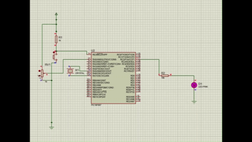
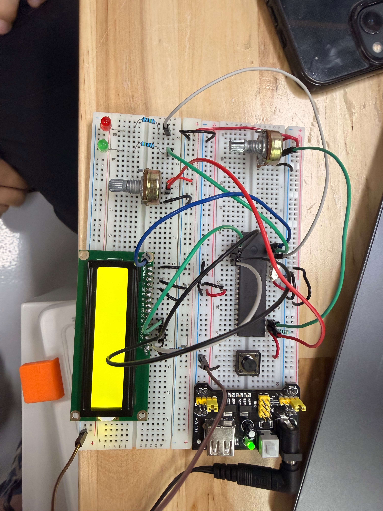

# Actividad 1 — PWM para controlar un LED con potenciómetro

## Descripción

En esta actividad se controló la intensidad de un LED utilizando el módulo **PWM por hardware** del PIC16F887. El brillo del LED se modifica mediante un potenciómetro conectado a `RA0/AN0`.

El valor analógico del potenciómetro se convierte mediante el ADC y se utiliza para modificar el ciclo de trabajo del PWM.

---

## Componentes utilizados

- PIC16F887
- LED
- Potenciómetro
- Resistencia para LED
- Cristal oscilador
- Botón de reset
- Fuente Vcc
- Tierra GND
- MPLAB X IDE
- Compilador XC8
- Proteus Design Suite

---

## Evidencias

### Simulación en Proteus

[](./evidencias_fisicas/Unled_sim.mp4)

## Evidencias físicas 

### Armado general del circuito 
 

### Video de funcionamiento físico 
[](./evidencias_fisicas/Unled_fisico.mp4)

---

## Funcionamiento del circuito

El potenciómetro entrega un voltaje variable al canal `AN0`. El ADC convierte ese valor a un dato digital de 10 bits.

Ese valor se utiliza como ciclo de trabajo del PWM generado por el módulo `CCP1` en el pin `RC2`.

---

## Lógica de programación

La lectura del potenciómetro se realiza con:

```c
pot = ADC_Read(0);
```

El valor ADC se manda al PWM:

```c
PWM_SetDuty(pot);
```

El módulo PWM se configura con Timer2:

```c
PR2 = 255;
CCP1CON = 0b00001100;
T2CON = 0b00000100;
```

---

## Código utilizado

```c
#include <xc.h>

// CONFIGURACIÓN
#pragma config FOSC = XT
#pragma config WDTE = OFF
#pragma config PWRTE = OFF
#pragma config BOREN = ON
#pragma config LVP = OFF
#pragma config CPD = OFF
#pragma config WRT = OFF
#pragma config CP = OFF

#define _XTAL_FREQ 4000000

void ADC_Init(void);
unsigned int ADC_Read(unsigned char canal);

void PWM_Init(void);
void PWM_SetDuty(unsigned int duty);

void main(void) {
    unsigned int pot = 0;

    ADC_Init();
    PWM_Init();

    while(1) {
        pot = ADC_Read(0);   // Lee potenciómetro en RA0 / AN0

        PWM_SetDuty(pot);    // Controla LED en RC2 / CCP1

        __delay_ms(10);
    }
}

void ADC_Init(void) {
    ANSEL = 0x01;      // AN0 analógico
    ANSELH = 0x00;     // Los demás digitales

    ADCON0 = 0x01;     // ADC encendido, canal AN0
    ADCON1 = 0x80;     // Justificado a la derecha, Vref = VDD y VSS

    TRISAbits.TRISA0 = 1;   // RA0 entrada
}

unsigned int ADC_Read(unsigned char canal) {
    ADCON0 &= 0b11000011;        // Limpia selección de canal
    ADCON0 |= (canal << 2);      // Selecciona canal

    __delay_us(30);

    GO_nDONE = 1;
    while(GO_nDONE);

    return (unsigned int)(((unsigned int)ADRESH << 8) | ADRESL);
}

void PWM_Init(void) {
    TRISCbits.TRISC2 = 0;    // RC2 salida PWM CCP1
    PORTC = 0x00;

    PR2 = 255;               // Periodo PWM

    CCP1CON = 0b00001100;    // CCP1 modo PWM

    T2CON = 0b00000100;      // Timer2 ON, prescaler 1:1
}

void PWM_SetDuty(unsigned int duty) {
    if(duty > 1023) {
        duty = 1023;
    }

    CCPR1L = (unsigned char)(duty >> 2);

    // Carga los 2 bits menos significativos del duty en CCP1CON bits 5 y 4
    CCP1CON = (CCP1CON & 0b11001111) | ((duty & 0x03) << 4);
}
```

---

## Resultado esperado

Al mover el potenciómetro, el brillo del LED debe variar suavemente desde apagado hasta máxima intensidad.

---

## Conclusión

Esta actividad permitió comprender cómo controlar la intensidad de un LED mediante PWM por hardware y una entrada analógica.
