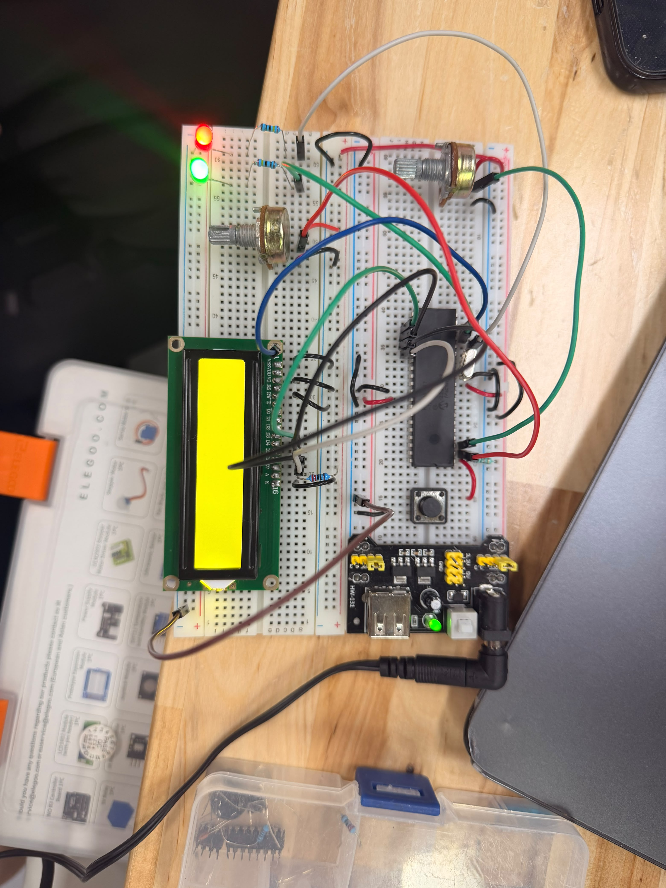

# Actividad en clase — PWM para controlar dos LEDs

## Descripción

En esta actividad se controló la intensidad de **dos LEDs** utilizando dos potenciómetros y los módulos PWM por hardware del **PIC16F887**.

El primer potenciómetro conectado a `RA0/AN0` controla el LED conectado a `RC2/CCP1`. El segundo potenciómetro conectado a `RA1/AN1` controla el LED conectado a `RC1/CCP2`.

---

## Componentes utilizados

- PIC16F887
- 2 LEDs
- 2 potenciómetros
- Resistencias para LEDs
- Cristal oscilador
- Botón de reset
- Fuente Vcc
- Tierra GND
- MPLAB X IDE
- Compilador XC8
- Proteus Design Suite

---

## Evidencias

### Simulación en Proteus

[](./evidencias_fisicas/Dosleds_sim.mp4)
## Evidencias físicas 

### Armado general del circuito 
 

### Video de funcionamiento físico
[](./evidencias_fisicas/Dosleds_fisico.mp4)

---

## Funcionamiento del circuito

Cada potenciómetro genera un valor analógico diferente. El ADC convierte esos valores a datos digitales de 10 bits. Después, cada valor se usa como ciclo de trabajo para un módulo PWM.

| Potenciómetro | Canal ADC | Salida PWM | LED |
|---|---|---|---|
| Potenciómetro 1 | AN0 | RC2 / CCP1 | LED 1 |
| Potenciómetro 2 | AN1 | RC1 / CCP2 | LED 2 |

---

## Lógica de programación

Los potenciómetros se leen en el ciclo principal:

```c
pot1 = ADC_Read(0);
pot2 = ADC_Read(1);
```

Después se actualiza el PWM de cada LED:

```c
PWM1_SetDuty(pot1);
PWM2_SetDuty(pot2);
```

---

## Código utilizado

```c
#include <xc.h>

// CONFIGURACIÓN
#pragma config FOSC = XT
#pragma config WDTE = OFF
#pragma config PWRTE = OFF
#pragma config BOREN = ON
#pragma config LVP = OFF
#pragma config CPD = OFF
#pragma config WRT = OFF
#pragma config CP = OFF

#define _XTAL_FREQ 8000000

void ADC_Init(void);
unsigned int ADC_Read(unsigned char canal);

void PWM_Init(void);
void PWM1_SetDuty(unsigned int duty);
void PWM2_SetDuty(unsigned int duty);

void main(void) {
    unsigned int pot1 = 0;
    unsigned int pot2 = 0;

    ADC_Init();
    PWM_Init();

    while(1) {
        pot1 = ADC_Read(0);   // Potenciómetro 1 en RA0 / AN0
        pot2 = ADC_Read(1);   // Potenciómetro 2 en RA1 / AN1

        PWM1_SetDuty(pot1);   // LED 1 en RC2 / CCP1
        PWM2_SetDuty(pot2);   // LED 2 en RC1 / CCP2

        __delay_ms(10);
    }
}

void ADC_Init(void) {
    ANSEL = 0x03;      // AN0 y AN1 analógicos
    ANSELH = 0x00;     // Los demás pines analógicos como digitales

    ADCON0 = 0x01;     // ADC encendido, inicia en canal AN0
    ADCON1 = 0x80;     // Justificado a la derecha, Vref = VDD y VSS

    TRISAbits.TRISA0 = 1;   // RA0 entrada
    TRISAbits.TRISA1 = 1;   // RA1 entrada
}

unsigned int ADC_Read(unsigned char canal) {
    ADCON0 &= 0b11000011;        // Limpia selección de canal
    ADCON0 |= (canal << 2);      // Selecciona canal AN0 o AN1

    __delay_us(30);              // Tiempo de adquisición

    GO_nDONE = 1;                // Inicia conversión
    while(GO_nDONE);             // Espera a que termine

    return (unsigned int)(((unsigned int)ADRESH << 8) | ADRESL);
}

void PWM_Init(void) {
    TRISCbits.TRISC2 = 0;    // RC2 salida PWM1
    TRISCbits.TRISC1 = 0;    // RC1 salida PWM2

    PORTC = 0x00;

    PR2 = 255;               // Periodo del PWM

    CCP1CON = 0b00001100;    // CCP1 en modo PWM
    CCP2CON = 0b00001100;    // CCP2 en modo PWM

    T2CON = 0b00000100;      // Timer2 ON, prescaler 1:1
}

void PWM1_SetDuty(unsigned int duty) {
    if(duty > 1023) {
        duty = 1023;
    }

    CCPR1L = (unsigned char)(duty >> 2);

    // Carga los 2 bits menos significativos del duty en CCP1CON bits 5 y 4
    CCP1CON = (CCP1CON & 0b11001111) | ((duty & 0x03) << 4);
}

void PWM2_SetDuty(unsigned int duty) {
    if(duty > 1023) {
        duty = 1023;
    }

    CCPR2L = (unsigned char)(duty >> 2);

    // Carga los 2 bits menos significativos del duty en CCP2CON bits 5 y 4
    CCP2CON = (CCP2CON & 0b11001111) | ((duty & 0x03) << 4);
}
```

---

## Resultado esperado

Cada potenciómetro debe controlar de forma independiente la intensidad de su LED correspondiente.

---

## Conclusión

Esta actividad permitió comprender el uso de los módulos CCP1 y CCP2 en modo PWM, además de reforzar la lectura de múltiples canales ADC.
