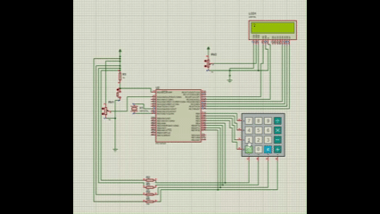
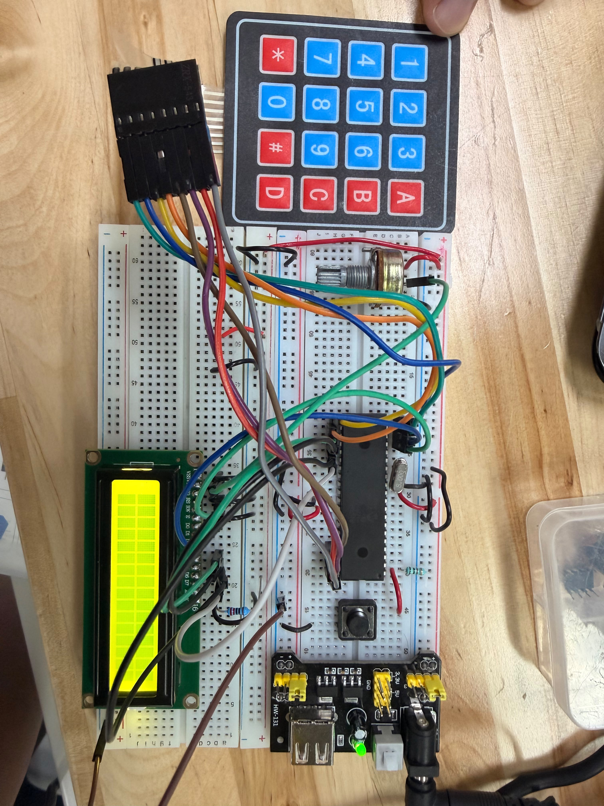

# Actividad en clase — Teclado matricial 4x4 con LCD

## Descripción

En esta actividad se utilizó un **teclado matricial 4x4** junto con una pantalla **LCD 16x2**. El objetivo fue leer las teclas presionadas y mostrarlas en la pantalla LCD.

El programa permite escribir caracteres en la primera línea y continuar en la segunda línea cuando se llena la primera.

---

## Componentes utilizados

- PIC16F887
- Teclado matricial 4x4
- Pantalla LCD 16x2
- Potenciómetro para contraste
- Cristal oscilador
- Botón de reset
- Fuente Vcc
- Tierra GND
- MPLAB X IDE
- Compilador XC8
- Proteus Design Suite
- Librería LCD

---

## Librería utilizada

Para el manejo de la pantalla LCD se utilizó la librería general del repositorio:

- [`lcd.h`](../../Libreria_LCD/lcd.h)
- [`lcd.c`](../../Libreria_LCD/lcd.c)

---

## Evidencias

### Simulación en Proteus

[](./evidencias_fisicas/Teclado_sim.mp4)

## Evidencias físicas
teclado
### Armado general del circuito 


### Video de funcionamiento físico 
[](./evidencias_fisicas/Teclado_fisico.mp4)

---

## Funcionamiento del circuito

El teclado matricial se conecta usando filas y columnas. En el programa, las filas se manejan desde `PORTD` y las columnas se leen desde `PORTB`.

El microcontrolador activa una fila a la vez y revisa si alguna columna cambia de estado. Cuando detecta una tecla, la muestra en la LCD.

---

## Lógica de programación

La matriz de teclas se define así:

```c
const char keys[4][4] = {
    {'1', '2', '3', 'A'},
    {'4', '5', '6', 'B'},
    {'7', '8', '9', 'C'},
    {'*', '0', '#', 'D'}
};
```

La función `Keypad_GetKey()` confirma la tecla presionada y evita lecturas falsas por rebote.

---

## Código utilizado

```c
#include <stdio.h>
#include <stdlib.h>
#include <xc.h>
#include <stdbool.h>
#include "lcd.h"

#pragma config FOSC = HS
#pragma config WDTE = OFF
#pragma config PWRTE = OFF
#pragma config BOREN = ON
#pragma config LVP = OFF
#pragma config CPD = OFF
#pragma config WRT = OFF
#pragma config CP = OFF

#define _XTAL_FREQ 8000000

void Keypad_Init(void);
char Keypad_Read(void);
char Keypad_GetKey(void);
void Keypad_WaitRelease(void);

void main(void) {
    char tecla;
    unsigned char pos = 0;

    ANSEL = 0x00;
    ANSELH = 0x00;

    LCD lcd = {&PORTC, 2, 3, 4, 5, 6, 7};
    LCD_Init(lcd);

    Keypad_Init();

    LCD_Clear();
    LCD_Set_Cursor(0, 0);
    LCD_putrs("Teclado listo");
    __delay_ms(500);
    LCD_Clear();

    while(1) {
        tecla = Keypad_GetKey();

        if(tecla != 0) {
            if(pos < 16) {
                LCD_Set_Cursor(0, pos);
            }
            else if(pos < 32) {
                LCD_Set_Cursor(1, pos - 16);
            }
            else {
                LCD_Clear();
                pos = 0;
                LCD_Set_Cursor(0, 0);
            }

            LCD_putc(tecla);
            pos++;

            Keypad_WaitRelease();
        }
    }
}

void Keypad_Init(void) {
    TRISD = 0b11110000;   // RD0-RD3 salidas
    PORTD = 0b00001111;   // Filas en 1

    TRISB = 0b11110000;   // RB4-RB7 entradas
    PORTB = 0x00;

    OPTION_REG &= 0b01111111;   // Activa pull-ups internos de PORTB
    WPUB = 0b11110000;          // Pull-ups en RB4, RB5, RB6, RB7
}

char Keypad_Read(void) {
    const char keys[4][4] = {
        {'1', '2', '3', 'A'},
        {'4', '5', '6', 'B'},
        {'7', '8', '9', 'C'},
        {'*', '0', '#', 'D'}
    };

    unsigned char fila;

    for(fila = 0; fila < 4; fila++) {
        PORTD = 0b00001111;
        PORTD &= ~(1 << fila);
        __delay_us(50);

        if((PORTB & 0b00010000) == 0) {
            PORTD = 0b00001111;
            return keys[fila][0];
        }

        if((PORTB & 0b00100000) == 0) {
            PORTD = 0b00001111;
            return keys[fila][1];
        }

        if((PORTB & 0b01000000) == 0) {
            PORTD = 0b00001111;
            return keys[fila][2];
        }

        if((PORTB & 0b10000000) == 0) {
            PORTD = 0b00001111;
            return keys[fila][3];
        }
    }

    PORTD = 0b00001111;
    return 0;
}

char Keypad_GetKey(void) {
    char tecla1;
    char tecla2;

    tecla1 = Keypad_Read();

    if(tecla1 != 0) {
        __delay_ms(15);
        tecla2 = Keypad_Read();

        if(tecla1 == tecla2) {
            return tecla1;
        }
    }

    return 0;
}

void Keypad_WaitRelease(void) {
    while(Keypad_Read() != 0) {
        __delay_ms(5);
    }

    __delay_ms(20);
}
```

---

## Resultado esperado

Cada tecla presionada debe mostrarse en la pantalla LCD. Al llenarse la primera línea, el texto continúa en la segunda línea.

---

## Conclusión

Esta actividad permitió comprender el escaneo de un teclado matricial, el uso de pull-ups internos y el despliegue de caracteres en LCD.
