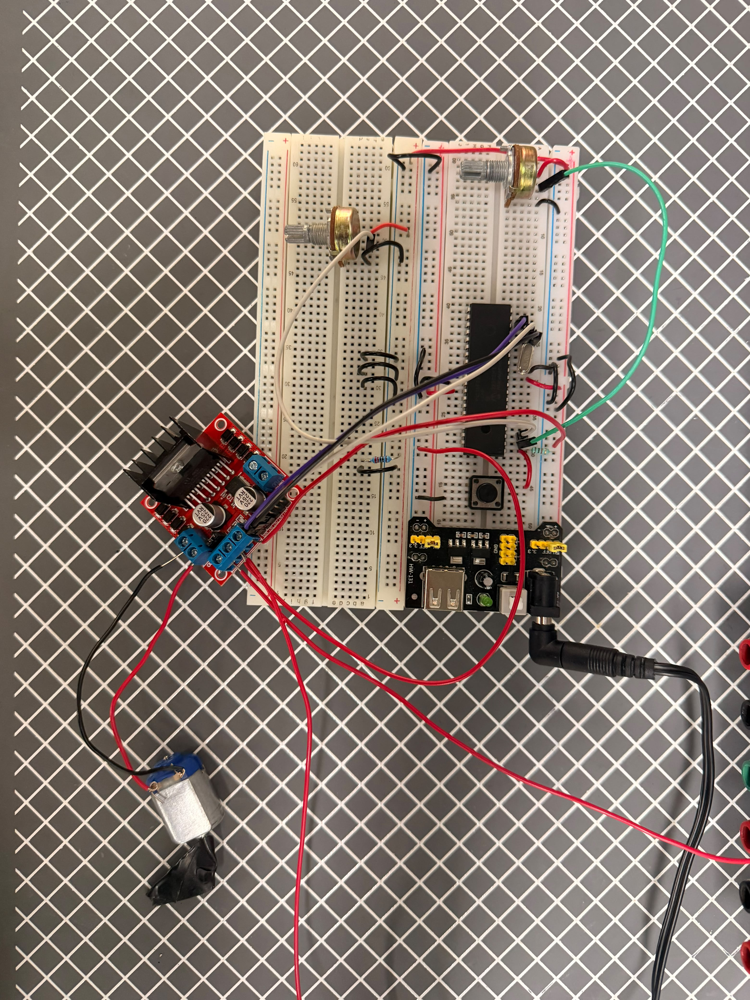

# Actividad 1 — Motor DC con control de velocidad y dirección

## Descripción

En esta actividad se controló un **motor DC** utilizando dos potenciómetros. El primer potenciómetro controla la velocidad y el segundo controla la dirección de giro.

A diferencia de la actividad anterior, aquí el PWM se implementa por software utilizando interrupciones del Timer2.

---

## Componentes utilizados

- PIC16F887
- Motor DC
- Driver de motor o puente H
- 2 potenciómetros
- Fuente externa para motor
- Tierra común
- Cristal oscilador
- Botón de reset
- MPLAB X IDE
- Compilador XC8
- Proteus Design Suite

---

## Evidencias

### Simulación en Proteus

[](./evidencias_fisicas/motor_sim.mp4)


## Evidencias físicas

### Armado general del circuito 
 

### Video de funcionamiento físico 
[](./evidencias_fisicas/motor_fisico.mp4)

---

## Funcionamiento del circuito

El potenciómetro conectado a `AN0` controla la velocidad. Su lectura se convierte a un porcentaje de 0 a 100 para definir el duty cycle.

El potenciómetro conectado a `AN1` controla la dirección. Si el valor está por debajo de cierto umbral, el motor gira hacia atrás. Si está por encima de otro umbral, gira hacia adelante. Si está en la zona central, el motor se detiene.

---

## Lógica de programación

La velocidad se calcula así:

```c
velocidad = (unsigned char)((pot_vel * 100UL) / 1023);
```

La dirección se determina con:

```c
if(pot_dir < 430){
    Motor_Atras();
}
else if(pot_dir > 590){
    Motor_Adelante();
}
else{
    Motor_Stop();
}
```

El PWM por software se genera en la interrupción de Timer2:

```c
if(pwm_count < pwm_duty){
    ENA = 1;
}
else{
    ENA = 0;
}
```

---

## Código utilizado

```c
#include <xc.h>

#pragma config FOSC = HS
#pragma config WDTE = OFF
#pragma config PWRTE = OFF
#pragma config BOREN = ON
#pragma config LVP = OFF
#pragma config CPD = OFF
#pragma config WRT = OFF
#pragma config CP = OFF

#define _XTAL_FREQ 8000000

#define IN1 PORTCbits.RC1
#define IN2 PORTCbits.RC2
#define ENA PORTCbits.RC3

volatile unsigned char pwm_count = 0;
volatile unsigned char pwm_duty = 0;

void ADC_Init(void);
unsigned int ADC_Read(unsigned char canal);
void Timer2_PWM_Init(void);

void Motor_Adelante(void);
void Motor_Atras(void);
void Motor_Stop(void);
void Motor_SetSpeed(unsigned char duty);

void main(void) {
    unsigned int pot_vel;
    unsigned int pot_dir;
    unsigned char velocidad;

    ADC_Init();

    TRISCbits.TRISC1 = 0;   // RC1 -> IN1
    TRISCbits.TRISC2 = 0;   // RC2 -> IN2
    TRISCbits.TRISC3 = 0;   // RC3 -> ENA / EN1

    PORTC = 0x00;

    Timer2_PWM_Init();
    Motor_Stop();

    while(1) {
        pot_vel = ADC_Read(0);   // RA0 controla velocidad
        pot_dir = ADC_Read(1);   // RA1 controla dirección

        velocidad = (unsigned char)((pot_vel * 100UL) / 1023);

        if(velocidad < 5) {
            velocidad = 0;
        }

        if(velocidad == 0) {
            Motor_Stop();
        }
        else {
            Motor_SetSpeed(velocidad);

            if(pot_dir < 430) {
                Motor_Atras();
            }
            else if(pot_dir > 590) {
                Motor_Adelante();
            }
            else {
                Motor_Stop();
            }
        }

        __delay_ms(20);
    }
}

void ADC_Init(void) {
    ANSEL = 0x03;       // RA0/AN0 y RA1/AN1 analógicos
    ANSELH = 0x00;      // Lo demás digital

    TRISAbits.TRISA0 = 1;
    TRISAbits.TRISA1 = 1;

    ADCON0 = 0x01;      // ADC encendido
    ADCON1 = 0x80;      // Justificado a la derecha
}

unsigned int ADC_Read(unsigned char canal) {
    ADCON0 &= 0b11000011;
    ADCON0 |= (canal << 2);

    __delay_us(50);

    GO_nDONE = 1;
    while(GO_nDONE);

    return (unsigned int)(((unsigned int)ADRESH << 8) | ADRESL);
}

void Timer2_PWM_Init(void) {
    PR2 = 49;               // Interrupción aprox cada 100 us
    T2CON = 0b00000101;     // Timer2 ON, prescaler 1:4

    TMR2IF = 0;
    TMR2IE = 1;
    PEIE = 1;
    GIE = 1;
}

void __interrupt() ISR(void) {
    if(TMR2IF) {
        TMR2IF = 0;

        pwm_count++;

        if(pwm_count >= 100) {
            pwm_count = 0;
        }

        if(pwm_count < pwm_duty) {
            ENA = 1;
        }
        else {
            ENA = 0;
        }
    }
}

void Motor_Adelante(void) {
    IN1 = 1;
    IN2 = 0;
}

void Motor_Atras(void) {
    IN1 = 0;
    IN2 = 1;
}

void Motor_Stop(void) {
    IN1 = 0;
    IN2 = 0;
    Motor_SetSpeed(0);
}

void Motor_SetSpeed(unsigned char duty) {
    if(duty > 100) {
        duty = 100;
    }

    pwm_duty = duty;
}
```

---

## Resultado esperado

El usuario debe poder controlar la velocidad del motor con un potenciómetro y la dirección con otro. En la zona central del potenciómetro de dirección, el motor debe detenerse.

---

## Conclusión

Esta actividad permitió implementar control de velocidad y dirección para un motor DC, además de utilizar PWM por software generado con interrupciones.
