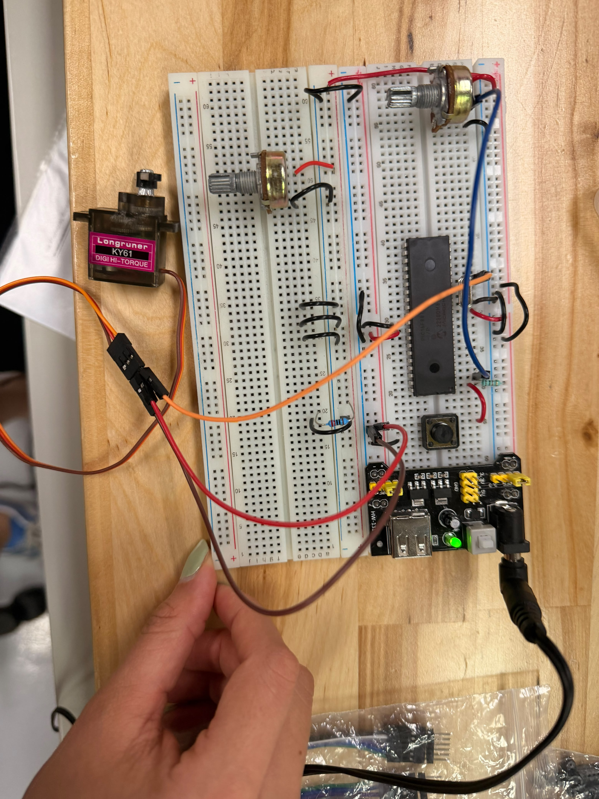

# Actividad 1 — Servo controlado con potenciómetro

## Descripción

En esta actividad se controló la posición de un **servomotor** mediante un potenciómetro conectado al canal `AN0` del PIC16F887.

El valor leído por el ADC se convierte en un ancho de pulso entre `500 us` y `2500 us`, permitiendo controlar la posición del servo en un rango aproximado de `0°` a `180°`.

---

## Componentes utilizados

- PIC16F887
- Servomotor
- Potenciómetro
- Fuente para servo
- Tierra común
- Cristal oscilador
- Botón de reset
- MPLAB X IDE
- Compilador XC8
- Proteus Design Suite

---

## Evidencias

### Simulación en Proteus

[](./evidencias_fisicas/servoP_simu.mp4)

## Evidencias físicas 

### Armado general del circuito 
 

### Video de funcionamiento físico Servo
[](./evidencias_fisicas/servoP_fisico.mp4)

---

## Funcionamiento del circuito

El potenciómetro entrega un voltaje variable al canal `AN0`. El ADC convierte este voltaje en un valor entre `0` y `1023`.

Ese valor se transforma en un pulso para el servo. Cuando el potenciómetro está al mínimo, el pulso se acerca a `500 us`; cuando está al máximo, se acerca a `2500 us`.

---

## Lógica de programación

Para suavizar la lectura del potenciómetro, el programa promedia ocho lecturas ADC:

```c
for(i = 0; i < 8; i++) {
    suma += ADC_Read(canal);
}

return (unsigned int)(suma / 8);
```

El valor ADC se convierte a pulso con:

```c
pulso = SERVO_MIN_US + (((unsigned long)adc_value * (SERVO_MAX_US - SERVO_MIN_US)) / 1023);
```

Después se manda el pulso al servo:

```c
Servo_Write(pulso);
```

---

## Código utilizado

```c
#include <xc.h>

#pragma config FOSC = HS
#pragma config WDTE = OFF
#pragma config PWRTE = OFF
#pragma config BOREN = ON
#pragma config LVP = OFF
#pragma config CPD = OFF
#pragma config WRT = OFF
#pragma config CP = OFF

#define _XTAL_FREQ 8000000

#define SERVO PORTCbits.RC0

#define SERVO_MIN_US 500
#define SERVO_MAX_US 2500

void Timer1_Init(void);
void Delay_us_TMR1(unsigned int us);

void ADC_Init(void);
unsigned int ADC_Read(unsigned char canal);
unsigned int ADC_Read_Avg(unsigned char canal);

void Servo_Write(unsigned int pulso_us);
void Servo_From_ADC(unsigned int adc_value);

void main(void) {
    unsigned int pot;

    ADC_Init();
    Timer1_Init();

    TRISCbits.TRISC0 = 0;
    SERVO = 0;

    while(1) {
        pot = ADC_Read_Avg(0);
        Servo_From_ADC(pot);
    }
}

void ADC_Init(void) {
    ANSEL = 0x01;
    ANSELH = 0x00;

    TRISAbits.TRISA0 = 1;

    ADCON0 = 0x01;
    ADCON1 = 0x80;
}

unsigned int ADC_Read(unsigned char canal) {
    ADCON0 &= 0b11000011;
    ADCON0 |= (canal << 2);

    __delay_us(50);

    GO_nDONE = 1;
    while(GO_nDONE);

    return (unsigned int)(((unsigned int)ADRESH << 8) | ADRESL);
}

unsigned int ADC_Read_Avg(unsigned char canal) {
    unsigned long suma = 0;
    unsigned char i;

    for(i = 0; i < 8; i++) {
        suma += ADC_Read(canal);
    }

    return (unsigned int)(suma / 8);
}

void Timer1_Init(void) {
    T1CON = 0b00110001;
}

void Delay_us_TMR1(unsigned int us) {
    unsigned int ticks;
    unsigned int carga;

    ticks = us / 4;

    if(ticks == 0) {
        ticks = 1;
    }

    carga = 65536 - ticks;

    TMR1H = carga >> 8;
    TMR1L = carga & 0xFF;

    TMR1IF = 0;
    TMR1ON = 1;

    while(TMR1IF == 0);

    TMR1ON = 0;
}

void Servo_Write(unsigned int pulso_us) {
    SERVO = 1;
    Delay_us_TMR1(pulso_us);

    SERVO = 0;
    Delay_us_TMR1(20000 - pulso_us);
}

void Servo_From_ADC(unsigned int adc_value) {
    unsigned int pulso;

    pulso = SERVO_MIN_US + (((unsigned long)adc_value * (SERVO_MAX_US - SERVO_MIN_US)) / 1023);

    Servo_Write(pulso);
}
```

---

## Resultado esperado

Al mover el potenciómetro, el servo debe cambiar de posición de manera proporcional, recorriendo aproximadamente de `0°` a `180°`.

---

## Conclusión

Esta actividad permitió integrar ADC y control de servomotor, convirtiendo una señal analógica en una señal de control por pulsos.
