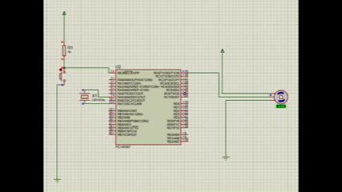
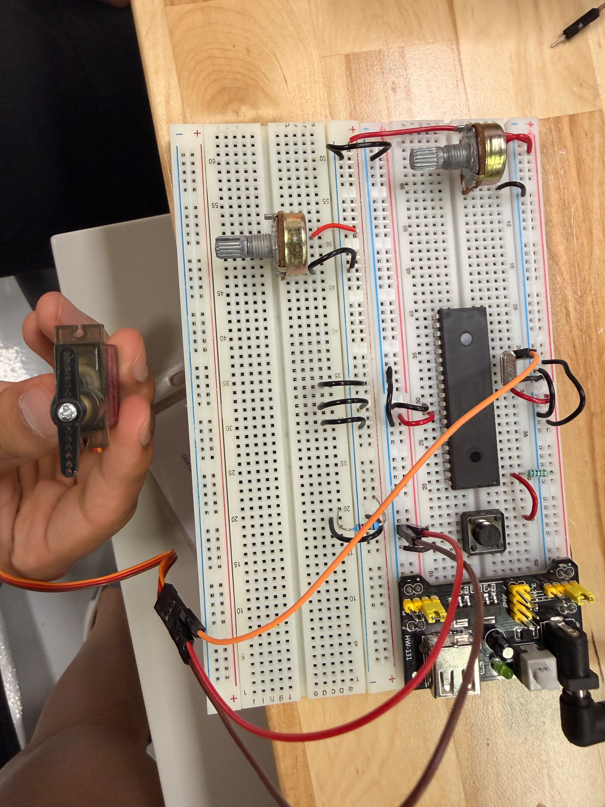

# Actividad en clase — Servo de 0° a 180°

## Descripción

En esta actividad se controló un **servomotor** utilizando el microcontrolador **PIC16F887**. El servo realiza un movimiento automático desde `0°` hasta `180°` y después regresa de `180°` a `0°`.

La señal de control se generó manualmente mediante pulsos temporizados con **Timer1**.

---

## Componentes utilizados

- PIC16F887
- Servomotor
- Fuente para servo
- Tierra común
- Cristal oscilador
- Botón de reset
- MPLAB X IDE
- Compilador XC8
- Proteus Design Suite

---

## Evidencias

### Simulación en Proteus

[](./evidencias_fisicas/servo_sim.mp4)


## Evidencias físicas

### Armado general del circuito 
 

### Video de funcionamiento físico 
[](./evidencias_fisicas/servo_fisico.mp4)

---

## Funcionamiento del circuito

El servo se controla mediante pulsos en el pin `RC0`. El ancho del pulso determina el ángulo del servo.

En esta actividad se utilizaron pulsos desde aproximadamente `500 us` hasta `2500 us`, equivalentes a un rango aproximado de `0°` a `180°`.

---

## Lógica de programación

El pulso se calcula con:

```c
pulso = SERVO_MIN_US + (((unsigned long)angulo * (SERVO_MAX_US - SERVO_MIN_US)) / 180);
```

El programa recorre los ángulos en dos ciclos:

```c
for(angulo = 0; angulo <= 180; angulo += 2){
    Servo_Angulo(angulo);
}

for(angulo = 180; angulo >= 0; angulo -= 2){
    Servo_Angulo(angulo);
}
```

---

## Código utilizado

```c
#include <xc.h>

#pragma config FOSC = HS
#pragma config WDTE = OFF
#pragma config PWRTE = OFF
#pragma config BOREN = ON
#pragma config LVP = OFF
#pragma config CPD = OFF
#pragma config WRT = OFF
#pragma config CP = OFF

#define _XTAL_FREQ 8000000

#define SERVO PORTCbits.RC0

#define SERVO_MIN_US 500
#define SERVO_MAX_US 2500

void Timer1_Init(void);
void Delay_us_TMR1(unsigned int us);
void Servo_Write(unsigned int pulso_us);
void Servo_Angulo(unsigned int angulo);

void main(void) {
    int angulo;

    ANSEL = 0x00;
    ANSELH = 0x00;

    TRISCbits.TRISC0 = 0;
    SERVO = 0;

    Timer1_Init();

    while(1) {
        for(angulo = 0; angulo <= 180; angulo += 2) {
            Servo_Angulo(angulo);
        }

        for(angulo = 180; angulo >= 0; angulo -= 2) {
            Servo_Angulo(angulo);
        }
    }
}

void Timer1_Init(void) {
    T1CON = 0b00110001;
}

void Delay_us_TMR1(unsigned int us) {
    unsigned int ticks;
    unsigned int carga;

    ticks = us / 4;

    if(ticks == 0) {
        ticks = 1;
    }

    carga = 65536 - ticks;

    TMR1H = carga >> 8;
    TMR1L = carga & 0xFF;

    TMR1IF = 0;
    TMR1ON = 1;

    while(TMR1IF == 0);

    TMR1ON = 0;
}

void Servo_Write(unsigned int pulso_us) {
    SERVO = 1;
    Delay_us_TMR1(pulso_us);

    SERVO = 0;
    Delay_us_TMR1(20000 - pulso_us);
}

void Servo_Angulo(unsigned int angulo) {
    unsigned int pulso;

    pulso = SERVO_MIN_US + (((unsigned long)angulo * (SERVO_MAX_US - SERVO_MIN_US)) / 180);

    Servo_Write(pulso);
}
```

---

## Resultado esperado

El servo debe moverse suavemente de `0°` a `180°` y después regresar de `180°` a `0°`.

---

## Conclusión

Esta actividad permitió comprender el control básico de un servomotor mediante pulsos y el uso de Timer1 para generar retardos precisos.
