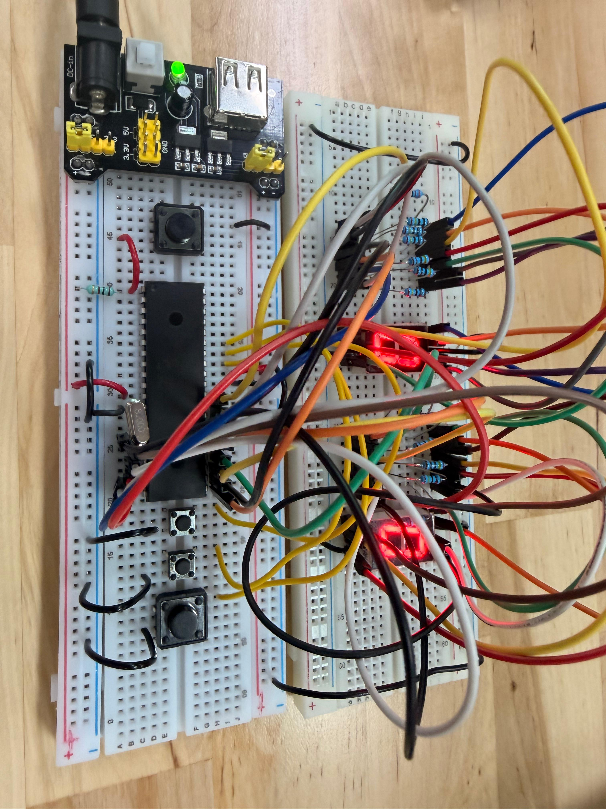

# Actividad 1 — Contador 0-99 con tres botones

## Descripción

En esta actividad se realizó un contador del **0 al 99** utilizando el microcontrolador **PIC16F887**, dos displays de 7 segmentos y tres botones de control. Cada botón tiene una función específica dentro del contador:

* Botón 1: sumar 1
* Botón 2: restar 1
* Botón 3: reiniciar el contador

El objetivo principal fue integrar entradas digitales con un sistema de visualización numérica. A diferencia de los contadores automáticos realizados anteriormente, en esta práctica el usuario controla el valor mostrado mediante botones.

Esta actividad permitió reforzar el uso de entradas digitales, salidas digitales, displays de 7 segmentos, lógica de conteo, antirrebote, condiciones y control de límites dentro de un programa para microcontrolador.

---

## Componentes utilizados

* PIC16F887
* 2 displays de 7 segmentos
* 3 botones
* Resistencias para los displays
* Resistencias para botones
* Cristal oscilador
* Botón de reset
* Resistencia para MCLR
* Fuente Vcc
* Tierra GND
* MPLAB X IDE
* Compilador XC8
* Proteus Design Suite

---

## Evidencias

### Simulación en Proteus

[](./video_simu_99.mp4)

---

## Evidencias físicas

Además de la simulación en Proteus, la práctica fue implementada físicamente utilizando el microcontrolador **PIC16F887**, dos displays de 7 segmentos y tres botones. En el circuito físico, los botones permiten modificar el valor mostrado en los displays.

### Armado general del circuito



### Funcionamiento físico

El siguiente GIF muestra una vista previa del funcionamiento físico. Al dar clic sobre el GIF, se abre el video completo de la evidencia.

[](./evidencias_fisicas/video_fisico_99.mp4)

### Carpeta completa de evidencias físicas

[Ver evidencias físicas](./evidencias_fisicas)

---

## Funcionamiento del circuito

El circuito utiliza el microcontrolador **PIC16F887** para controlar un contador de dos dígitos. El valor del contador se muestra en dos displays de 7 segmentos: uno representa las unidades y el otro las decenas.

Los botones funcionan como entradas digitales. Cuando el usuario presiona el botón de suma, el contador aumenta en una unidad. Cuando se presiona el botón de resta, el contador disminuye en una unidad. El botón de reinicio coloca el contador nuevamente en `00`.

El programa separa el valor del contador en decenas y unidades para mostrar cada dígito en su display correspondiente. En este caso, las unidades se muestran mediante `PORTC` y las decenas mediante `PORTD`.

---

## Lógica de programación

Primero se declaran las variables principales del programa:

```c
unsigned char Estado1, Estado2, Estado3;
unsigned char contador = 0;
unsigned char unidades = 0;
unsigned char decenas = 0;
```

La variable `contador` almacena el valor actual que se muestra en los displays. Las variables `unidades` y `decenas` se utilizan para separar el número en dos dígitos. Por otra parte, `Estado1`, `Estado2` y `Estado3` permiten detectar una sola pulsación por botón, evitando que el contador cambie muchas veces mientras el botón permanece presionado.

Después se define el arreglo `numeros`, el cual contiene los patrones necesarios para mostrar los números del 0 al 9 en un display de 7 segmentos:

```c
const unsigned char numeros[10] = {
    0b00111111, // 0
    0b00000110, // 1
    0b01011011, // 2
    0b01001111, // 3
    0b01100110, // 4
    0b01101101, // 5
    0b01111101, // 6
    0b00000111, // 7
    0b01111111, // 8
    0b01101111  // 9
};
```

Posteriormente se desactivan las entradas analógicas para que los pines funcionen como entradas y salidas digitales:

```c
ANSEL = 0x00;
ANSELH = 0x00;
```

También se habilitan las resistencias pull-up internas del puerto B:

```c
OPTION_REG = OPTION_REG & 0b01111111;
```

Después se configuran los puertos:

```c
TRISB = 0xFF;
TRISC = 0x00;
TRISD = 0x00;
```

`PORTB` se configura como entrada porque ahí se conectan los botones. `PORTC` y `PORTD` se configuran como salidas porque ahí se conectan los displays de 7 segmentos.

Dentro del ciclo principal, el programa separa el contador en unidades y decenas:

```c
unidades = contador % 10;
decenas = contador / 10;
```

Después muestra cada dígito en su respectivo display:

```c
PORTC = numeros[unidades];
PORTD = numeros[decenas];
```

El botón conectado en `RB0` aumenta el contador:

```c
if(!PORTBbits.RB0 && Estado1 == 0){
    __delay_ms(50);

    if(!PORTBbits.RB0){
        contador++;

        if(contador > 99){
            contador = 0;
        }

        Estado1 = 1;
    }
}
```

El botón conectado en `RB1` disminuye el contador:

```c
if(!PORTBbits.RB1 && Estado2 == 0){
    __delay_ms(50);

    if(!PORTBbits.RB1){
        if(contador == 0){
            contador = 99;
        }
        else{
            contador--;
        }

        Estado2 = 1;
    }
}
```

El botón conectado en `RB2` reinicia el contador a cero:

```c
if(!PORTBbits.RB2 && Estado3 == 0){
    __delay_ms(50);

    if(!PORTBbits.RB2){
        contador = 0;
        Estado3 = 1;
    }
}
```

El retardo de `50 ms` funciona como antirrebote básico para evitar lecturas falsas generadas por el rebote mecánico de los botones.

| Botón   | Entrada | Acción         |
| ------- | ------- | -------------- |
| Botón 1 | RB0     | Sumar 1        |
| Botón 2 | RB1     | Restar 1       |
| Botón 3 | RB2     | Reiniciar a 00 |

---

## Código utilizado

```c
#include <xc.h>

//=============================================================================
// CONFIGURACIÓN DE BITS DE CONFIGURACIÓN
//=============================================================================

#pragma config FOSC = HS        // Selección del oscilador: HS para cristal de alta velocidad
#pragma config WDTE = OFF       // Watchdog Timer desactivado
#pragma config PWRTE = OFF      // Power-up Timer desactivado
#pragma config BOREN = ON       // Brown-out Reset activado
#pragma config LVP = OFF        // Programación en bajo voltaje desactivada
#pragma config CPD = OFF        // Protección de memoria EEPROM desactivada
#pragma config WRT = OFF        // Escritura en memoria Flash desactivada
#pragma config CP = OFF         // Protección de código desactivada

//=============================================================================
// DEFINICIONES
//=============================================================================

#define _XTAL_FREQ 8000000      // Frecuencia del oscilador utilizada para retardos

//=============================================================================
// VARIABLES GLOBALES
//=============================================================================

unsigned char Estado1, Estado2, Estado3;   // Variables para detectar una sola pulsación por botón
unsigned char contador = 0;                // Variable principal del contador, rango de 0 a 99
unsigned char unidades = 0;                // Dígito de unidades
unsigned char decenas = 0;                 // Dígito de decenas

// Tabla de patrones para display de 7 segmentos
// Cada valor representa los segmentos necesarios para mostrar un número
const unsigned char numeros[10] = {
    0b00111111, // 0
    0b00000110, // 1
    0b01011011, // 2
    0b01001111, // 3
    0b01100110, // 4
    0b01101101, // 5
    0b01111101, // 6
    0b00000111, // 7
    0b01111111, // 8
    0b01101111  // 9
};

//=============================================================================
// PROGRAMA PRINCIPAL
//=============================================================================

void main(void){

    //-------------------------------------------------------------------------
    // Configuración de pines digitales
    //-------------------------------------------------------------------------

    ANSEL = 0x00;       // Desactiva entradas analógicas AN0-AN7
    ANSELH = 0x00;      // Desactiva entradas analógicas AN8-AN13

    //-------------------------------------------------------------------------
    // Configuración de pull-ups internos del puerto B
    //-------------------------------------------------------------------------

    OPTION_REG = OPTION_REG & 0b01111111;
    // Limpia el bit RBPU para habilitar las resistencias pull-up internas del PORTB

    //-------------------------------------------------------------------------
    // Configuración de puertos
    //-------------------------------------------------------------------------

    TRISB = 0xFF;       // PORTB como entrada para los botones
    TRISC = 0x00;       // PORTC como salida para el display de unidades
    TRISD = 0x00;       // PORTD como salida para el display de decenas

    PORTC = 0x00;       // Inicializa display de unidades apagado
    PORTD = 0x00;       // Inicializa display de decenas apagado

    // Inicialización de estados de botones
    Estado1 = 0;
    Estado2 = 0;
    Estado3 = 0;

    //-------------------------------------------------------------------------
    // Ciclo principal
    //-------------------------------------------------------------------------

    while(1){

        //---------------------------------------------------------------------
        // Separación del número en unidades y decenas
        //---------------------------------------------------------------------

        unidades = contador % 10;       // Obtiene el dígito de unidades
        decenas = contador / 10;        // Obtiene el dígito de decenas

        //---------------------------------------------------------------------
        // Mostrar el número en los displays
        //---------------------------------------------------------------------

        PORTC = numeros[unidades];      // Muestra unidades en el display conectado a PORTC
        PORTD = numeros[decenas];       // Muestra decenas en el display conectado a PORTD

        //---------------------------------------------------------------------
        // Botón RB0: sumar 1
        //---------------------------------------------------------------------

        if(!PORTBbits.RB0 && Estado1 == 0){
            __delay_ms(50);             // Retardo antirrebote

            if(!PORTBbits.RB0){
                contador++;             // Incrementa el contador

                if(contador > 99){      // Si supera 99, regresa a 0
                    contador = 0;
                }

                Estado1 = 1;            // Marca que el botón ya fue detectado
            }
        }

        if(PORTBbits.RB0){
            Estado1 = 0;                // Libera el estado cuando se suelta el botón
        }

        //---------------------------------------------------------------------
        // Botón RB1: restar 1
        //---------------------------------------------------------------------

        if(!PORTBbits.RB1 && Estado2 == 0){
            __delay_ms(50);             // Retardo antirrebote

            if(!PORTBbits.RB1){
                if(contador == 0){
                    contador = 99;      // Si está en 0 y se resta, pasa a 99
                }
                else{
                    contador--;         // Decrementa el contador
                }

                Estado2 = 1;            // Marca que el botón ya fue detectado
            }
        }

        if(PORTBbits.RB1){
            Estado2 = 0;                // Libera el estado cuando se suelta el botón
        }

        //---------------------------------------------------------------------
        // Botón RB2: reiniciar contador
        //---------------------------------------------------------------------

        if(!PORTBbits.RB2 && Estado3 == 0){
            __delay_ms(50);             // Retardo antirrebote

            if(!PORTBbits.RB2){
                contador = 0;           // Reinicia el contador a 00
                Estado3 = 1;            // Marca que el botón ya fue detectado
            }
        }

        if(PORTBbits.RB2){
            Estado3 = 0;                // Libera el estado cuando se suelta el botón
        }
    }
}
```

---

## Resultado esperado

Al ejecutar la simulación, los dos displays de 7 segmentos deben mostrar un número entre `00` y `99`.

El botón conectado en `RB0` debe aumentar el valor mostrado en una unidad. El botón conectado en `RB1` debe disminuir el valor mostrado en una unidad. El botón conectado en `RB2` debe reiniciar el contador y mostrar `00`.

Cuando el contador llega a `99` y se presiona el botón de suma, el valor vuelve a `00`. Cuando el contador está en `00` y se presiona el botón de resta, el valor cambia a `99`.

---

## Conclusión

Esta actividad permitió integrar entradas digitales y salidas digitales en un mismo sistema. Mediante tres botones se logró controlar un contador de dos dígitos mostrado en displays de 7 segmentos. También se reforzó el uso de arreglos, operaciones aritméticas para separar unidades y decenas, lógica de antirrebote y control de límites dentro de un programa para el microcontrolador PIC16F887.
