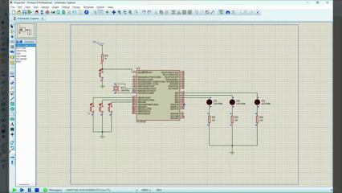

# Actividad en clase — Control de 3 LEDs con 3 botones

## Descripción

En esta actividad se realizó el control de **3 LEDs** mediante **3 botones independientes** utilizando el microcontrolador **PIC16F887**. El objetivo principal fue trabajar con entradas y salidas digitales, donde cada botón controla directamente el encendido de un LED específico.

A diferencia de prácticas anteriores, donde se trabajaba principalmente con salidas digitales para encender LEDs, matrices o displays, en esta actividad se incorporaron **entradas digitales** mediante botones. Esto permitió observar cómo el microcontrolador puede leer señales externas y responder a ellas mediante salidas.

Cada botón fue conectado a una entrada del puerto B y cada LED a una salida del puerto D. Cuando se presiona un botón, el programa detecta el cambio de estado lógico y enciende el LED correspondiente.

---

## Componentes utilizados

* PIC16F887
* 3 LEDs
* 3 botones
* Resistencias para LEDs
* Resistencias para botones
* Cristal oscilador
* Botón de reset
* Resistencia para MCLR
* Fuente Vcc
* Tierra GND
* MPLAB X IDE
* Compilador XC8
* Proteus Design Suite

---

## Evidencias

### Simulación en Proteus



### Video de funcionamiento en simulación

El siguiente enlace abre el video completo de la simulación en Proteus.

[▶ Ver video de funcionamiento](./video_funcionamiento.mp4)

---

## Evidencias físicas

Además de la simulación en Proteus, la actividad fue implementada físicamente en protoboard utilizando el microcontrolador **PIC16F887**, tres botones y tres LEDs. En el circuito físico, cada botón funciona como entrada digital y cada LED como salida digital.

### Armado general del circuito


### Funcionamiento físico

El siguiente GIF muestra una vista previa del funcionamiento físico. Al dar clic sobre el GIF, se abre el video completo de la evidencia.

[](./evidencias_fisicas/video_fisico.mp4)

### Carpeta completa de evidencias físicas

[Ver evidencias físicas](./evidencias_fisicas)

---

## Funcionamiento del circuito

El circuito utiliza el microcontrolador **PIC16F887** para leer el estado de tres botones conectados al puerto B. Dependiendo del botón presionado, el programa activa una salida diferente del puerto D para encender el LED correspondiente.

Los botones se conectan a las entradas `RB0`, `RB1` y `RB2`, mientras que los LEDs se conectan a las salidas `RD0`, `RD1` y `RD2`.

En esta práctica se trabaja con lógica invertida debido al uso de resistencias pull-up internas. Esto significa que cuando un botón no está presionado, el pin lee un `1`; cuando el botón se presiona, el pin lee un `0`. Por esta razón, en el código se utiliza el operador `!` para invertir la lectura del botón y encender el LED cuando el botón sea presionado.

---

## Lógica de programación

Primero se desactivan las entradas analógicas del microcontrolador para asegurar que los pines funcionen como entradas y salidas digitales:

```c
ANSEL = 0x00;
ANSELH = 0x00;
```

Después se habilitan las resistencias pull-up internas del puerto B mediante el registro `OPTION_REG`:

```c
OPTION_REG = OPTION_REG & 0b01111111;
```

Posteriormente se configura el puerto B como entrada, ya que ahí se conectan los botones, y el puerto D como salida, ya que ahí se conectan los LEDs:

```c
TRISB = 0xFF;
TRISD = 0x00;
```

Dentro del ciclo infinito, el programa lee constantemente el estado de los botones conectados en `RB0`, `RB1` y `RB2`. Cada botón controla un LED conectado al puerto D:

```c
PORTDbits.RD0 = !PORTBbits.RB0;
PORTDbits.RD1 = !PORTBbits.RB1;
PORTDbits.RD2 = !PORTBbits.RB2;
```

La relación entre botón y LED es la siguiente:

| Botón   | Entrada | LED controlado | Salida |
| ------- | ------- | -------------- | ------ |
| Botón 1 | RB0     | LED 1          | RD0    |
| Botón 2 | RB1     | LED 2          | RD1    |
| Botón 3 | RB2     | LED 3          | RD2    |

---

## Código utilizado

```c
#include <xc.h>         // Biblioteca principal del compilador XC8

//=============================================================================
// CONFIGURACIÓN DE BITS DE CONFIGURACIÓN
//=============================================================================

#pragma config FOSC = HS        // Selección del oscilador: HS para cristal de alta velocidad
#pragma config WDTE = OFF       // Watchdog Timer desactivado
#pragma config PWRTE = OFF      // Power-up Timer desactivado
#pragma config BOREN = ON       // Brown-out Reset activado
#pragma config LVP = OFF        // Programación en bajo voltaje desactivada
#pragma config CPD = OFF        // Protección de memoria EEPROM desactivada
#pragma config WRT = OFF        // Escritura en memoria Flash desactivada
#pragma config CP = OFF         // Protección de código desactivada

//=============================================================================
// DEFINICIONES
//=============================================================================

#define _XTAL_FREQ 8000000      // Frecuencia del oscilador utilizada para retardos

//=============================================================================
// PROGRAMA PRINCIPAL
//=============================================================================

void main(void){

    //-------------------------------------------------------------------------
    // Configuración de entradas analógicas como digitales
    //-------------------------------------------------------------------------

    ANSEL = 0x00;               // Desactiva entradas analógicas AN0-AN7
    ANSELH = 0x00;              // Desactiva entradas analógicas AN8-AN13

    //-------------------------------------------------------------------------
    // Configuración de pull-ups internos del puerto B
    //-------------------------------------------------------------------------

    OPTION_REG = OPTION_REG & 0b01111111;
    // Limpia el bit RBPU para habilitar las resistencias pull-up internas del PORTB

    //-------------------------------------------------------------------------
    // Configuración de puertos
    //-------------------------------------------------------------------------

    TRISB = 0xFF;               // Configura PORTB como entrada para los botones
    TRISD = 0x00;               // Configura PORTD como salida para los LEDs

    PORTD = 0x00;               // Inicializa los LEDs apagados

    //-------------------------------------------------------------------------
    // Ciclo principal
    //-------------------------------------------------------------------------

    while(1){

        // Botón conectado en RB0 controla LED conectado en RD0
        PORTDbits.RD0 = !PORTBbits.RB0;

        // Botón conectado en RB1 controla LED conectado en RD1
        PORTDbits.RD1 = !PORTBbits.RB1;

        // Botón conectado en RB2 controla LED conectado en RD2
        PORTDbits.RD2 = !PORTBbits.RB2;
    }
}
```

---

## Resultados experimentales

Al ejecutar la simulación, cada botón debe controlar un LED diferente. Al presionar el primer botón se enciende el LED conectado a `RD0`, al presionar el segundo botón se enciende el LED conectado a `RD1` y al presionar el tercer botón se enciende el LED conectado a `RD2`.

Cuando los botones no están presionados, los LEDs deben permanecer apagados.

---

## Conclusión

Esta actividad permitió comprender el uso de entradas digitales en el microcontrolador PIC16F887. Se reforzó la lectura de botones, el control de salidas digitales y la relación entre señales externas y respuestas del microcontrolador. Además, esta práctica sirvió como base para actividades más completas donde los botones se utilizan para modificar el comportamiento de un sistema.
