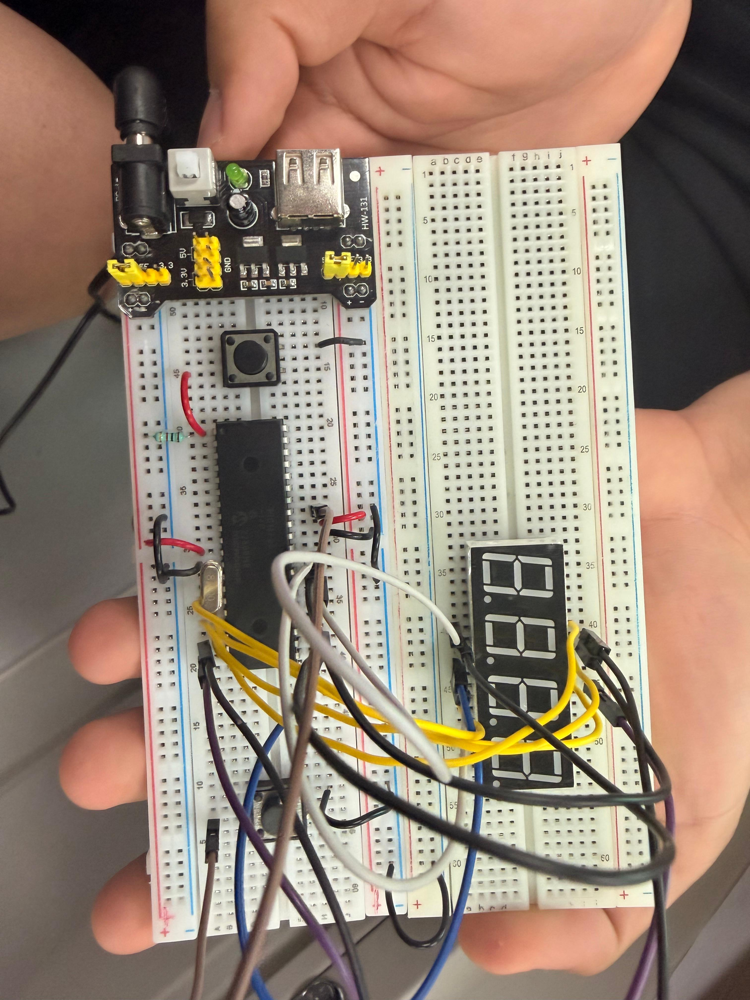

# Actividad 1 — Contador 0-9999 con cambio de dirección

## Descripción

En esta actividad se realizó un contador de **0 a 9999** utilizando una pantalla de **4 displays de 7 segmentos** y el microcontrolador **PIC16F887**. El contador puede trabajar en dos modos: conteo ascendente y conteo descendente.

El cambio de dirección se realiza mediante un botón conectado al pin `RB0/INT`. Cada vez que se presiona el botón, se activa una interrupción externa que cambia el valor de la variable `direccion`. Si la variable indica modo ascendente, el contador aumenta; si indica modo descendente, el contador disminuye.

Esta práctica integró multiplexado, interrupciones externas, manejo de displays y lógica de control de dirección.

---

## Componentes utilizados

- PIC16F887
- Pantalla de 4 displays de 7 segmentos
- Botón para interrupción externa
- Resistencias para displays y botón
- Cristal oscilador
- Botón de reset
- Resistencia para MCLR
- Fuente Vcc
- Tierra GND
- MPLAB X IDE
- Compilador XC8
- Proteus Design Suite

---

## Evidencias

### Simulación en Proteus

[](./video_simu_interfin.mp4)

---

## Evidencias físicas

Además de la simulación en Proteus, la práctica puede implementarse físicamente utilizando el microcontrolador **PIC16F887**, una pantalla de 4 displays de 7 segmentos y un botón para cambiar la dirección del conteo.

### Armado general del circuito



### Funcionamiento físico

[](./evidencias_fisicas/video_fisico_interfin.mp4)

### Carpeta completa de evidencias físicas

[Ver evidencias físicas](./evidencias_fisicas)

---

## Funcionamiento del circuito

El circuito utiliza `PORTD` para enviar los patrones de segmentos y `PORTC` para seleccionar cuál de los cuatro displays está activo. La visualización del número se realiza mediante multiplexado.

El programa separa el número actual en millar, centena, decena y unidad. Después activa cada display durante un tiempo muy corto. Al repetirse rápidamente, el ojo humano percibe los cuatro dígitos encendidos al mismo tiempo.

El botón conectado a `RB0/INT` permite cambiar la dirección del contador. Cuando ocurre una interrupción, la variable `direccion` cambia de estado, alternando entre conteo ascendente y descendente.

---

## Lógica de programación

Primero se define el arreglo de patrones del display de 7 segmentos:

```c
unsigned char patron[10] = {
    0x3F, // 0
    0x06, // 1
    0x5B, // 2
    0x4F, // 3
    0x66, // 4
    0x6D, // 5
    0x7D, // 6
    0x07, // 7
    0x7F, // 8
    0x67  // 9
};
```

La variable `direccion` indica el sentido de conteo:

```c
unsigned char direccion = 1;
```

La función `mostrar_numero()` separa el número en cuatro dígitos:

```c
millar = num / 1000;
centena = (num / 100) % 10;
decena = (num / 10) % 10;
unidad = num % 10;
```

Después muestra cada dígito mediante multiplexado:

```c
PORTC = 0b11110111;
PORTD = patron[millar];
__delay_ms(1);
```

En el ciclo principal, si `direccion` vale `1`, el contador aumenta. Si vale `0`, el contador disminuye:

```c
if(direccion == 1){
    num++;
} else {
    num--;
}
```

La interrupción externa cambia la dirección del conteo:

```c
void __interrupt() ISR(void){
    if(INTF){
        if(PORTBbits.RB0 == 0){
            direccion = !direccion;
        }
        INTF = 0;
    }
}
```

---

## Código utilizado

```c
#include <xc.h>

//=============================================================================
// CONFIGURACIÓN DE BITS DE CONFIGURACIÓN
//=============================================================================

#pragma config FOSC = XT        // Selección del oscilador XT
#pragma config WDTE = OFF       // Watchdog Timer desactivado
#pragma config PWRTE = OFF      // Power-up Timer desactivado
#pragma config BOREN = ON       // Brown-out Reset activado
#pragma config LVP = OFF        // Programación en bajo voltaje desactivada
#pragma config CPD = OFF        // Protección EEPROM desactivada
#pragma config WRT = OFF        // Escritura en memoria Flash desactivada
#pragma config CP = OFF         // Protección de código desactivada

//=============================================================================
// DEFINICIONES
//=============================================================================

#define _XTAL_FREQ 8000000      // Frecuencia del oscilador utilizada para retardos

unsigned char patron[10] = {
    0x3F, // 0
    0x06, // 1
    0x5B, // 2
    0x4F, // 3
    0x66, // 4
    0x6D, // 5
    0x7D, // 6
    0x07, // 7
    0x7F, // 8
    0x67  // 9
};

unsigned char direccion = 1; // 1 = ascendente, 0 = descendente

void mostrar_numero(int num){
    
    int millar;
    int centena;
    int decena;
    int unidad;
    
    millar = num / 1000;
    centena = (num / 100) % 10;
    decena = (num / 10) % 10;
    unidad = num % 10;
    
    PORTC = 0b11110111;     // Activa display de millares
    PORTD = patron[millar];
    __delay_ms(1);
    
    PORTC = 0b11111011;     // Activa display de centenas
    PORTD = patron[centena];
    __delay_ms(1);
    
    PORTC = 0b11111101;     // Activa display de decenas
    PORTD = patron[decena];
    __delay_ms(1);
    
    PORTC = 0b11111110;     // Activa display de unidades
    PORTD = patron[unidad];
    __delay_ms(1);
}

void main(void){
    
    ANSEL = 0x00;
    ANSELH = 0x00;
    
    OPTION_REG = OPTION_REG & 0b01111111;
    
    TRISD = 0x00;   // PORTD como salida para segmentos
    TRISC = 0x00;   // PORTC como salida para selección de displays
    TRISB = 0xFF;   // PORTB como entrada para botón
    
    PORTD = 0x00;
    PORTC = 0xFF;
    
    GIE = 1;        // Activa interrupciones globales
    INTE = 1;       // Activa interrupción externa RB0/INT
    INTEDG = 0;     // Interrupción por flanco de bajada
    INTF = 0;       // Limpia bandera de interrupción
    
    int num = 0;
    
    while(1){
        
        for(int i = 0; i < 25; i++){
            mostrar_numero(num);
        }
        
        if(direccion == 1){
            num++;
            
            if(num > 9999){
                num = 0;
            }
        }
        else{
            num--;
            
            if(num < 0){
                num = 9999;
            }
        }
    }
}

void __interrupt() ISR(void){
    
    if(INTF){
              
        if(PORTBbits.RB0 == 0){
            direccion = !direccion; // Cambia entre ascendente y descendente
        }
        
        INTF = 0; // Limpia bandera de interrupción
    }
}
```

---

## Resultado esperado

Al ejecutar la simulación, la pantalla de cuatro displays debe mostrar un contador de `0000` a `9999`. Al presionar el botón de interrupción, el conteo cambia de dirección. Si estaba contando de forma ascendente, comienza a contar de forma descendente; si estaba contando de forma descendente, vuelve a contar de forma ascendente.

---

## Conclusión

Esta actividad permitió integrar multiplexado de cuatro displays con interrupciones externas. Se reforzó el uso de funciones, separación de dígitos, manejo de variables de estado y control de dirección mediante un botón. Además, permitió comprender cómo una interrupción puede modificar el comportamiento principal del programa sin detener completamente su ejecución.
