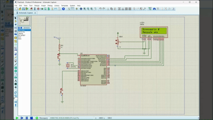
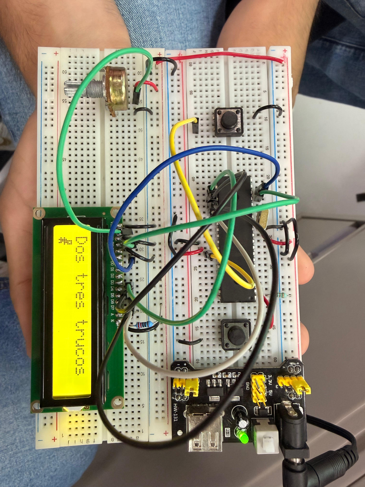
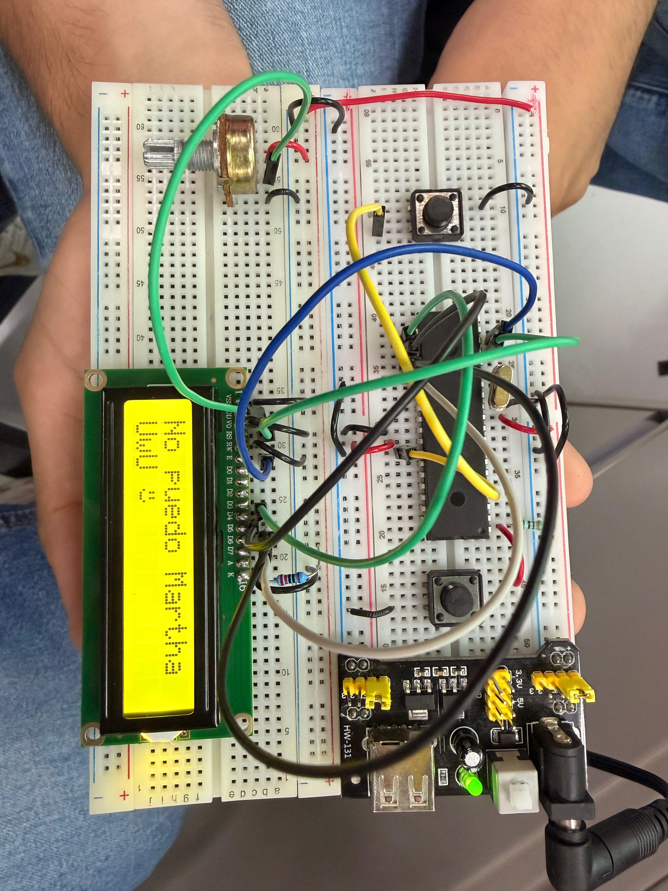

# Actividad 1 — LCD: mensajes con caracteres especiales

## Descripción

En esta actividad se utilizó una **pantalla LCD 16x2** controlada mediante el microcontrolador **PIC16F887** para desplegar dos mensajes diferentes. Cada mensaje incluye un carácter especial personalizado creado desde código.

Los caracteres personalizados utilizados fueron:

- Dinosaurio
- Carita

El cambio entre mensajes se realiza mediante un botón conectado al pin `RB0`. Cada vez que se presiona el botón, el programa alterna entre el mensaje uno y el mensaje dos.

Esta práctica permitió reforzar el uso de pantallas LCD, botones como entradas digitales, librerías externas, caracteres personalizados y lógica de cambio de estado.

---

## Componentes utilizados

- PIC16F887
- Pantalla LCD 16x2
- Botón
- Potenciómetro para ajuste de contraste
- Cristal oscilador
- Botón de reset
- Resistencia para MCLR
- Fuente Vcc
- Tierra GND
- MPLAB X IDE
- Compilador XC8
- Proteus Design Suite
- Librería `lcd.h`

---

## Evidencias

### Simulación en Proteus

[](./video_simu_lcd.mp4)

---

## Evidencias físicas

Además de la simulación en Proteus, la práctica puede implementarse físicamente utilizando el microcontrolador **PIC16F887**, una pantalla LCD 16x2 y un botón para alternar los mensajes.

### Armado general del circuito


### Funcionamiento físico

A continuación se muestran los dos estados de la pantalla LCD. Cada estado corresponde al mensaje que se despliega al presionar el botón.

<table>
  <tr>
    <td align="center"><strong>Estado 1: Dos tres trucos</strong></td>
    <td align="center"><strong>Estado 2: No puedo Martha</strong></td>
  </tr>
  <tr>
    <td align="center">
      
    </td>
    <td align="center">
      
    </td>
  </tr>
</table>

### Carpeta completa de evidencias físicas

[Ver evidencias físicas](./evidencias_fisicas)

---

## Funcionamiento del circuito

El circuito utiliza una pantalla **LCD 16x2** conectada al puerto C del microcontrolador **PIC16F887**. La pantalla se controla mediante una librería externa llamada `lcd.h`, la cual permite inicializar el LCD, limpiar la pantalla, colocar el cursor y escribir texto.

El botón se conecta al pin `RB0`, configurado como entrada digital. Cuando el botón se presiona, el programa cambia el estado de una variable llamada `estado`, la cual determina cuál de los dos mensajes debe mostrarse.

También se crean dos caracteres especiales dentro de la memoria CGRAM del LCD. El primer carácter corresponde a un dinosaurio y el segundo a una carita.

---

## Lógica de programación

Primero se incluyen las librerías necesarias, incluyendo la librería del LCD:

```c
#include <xc.h> 
#include <stdio.h>
#include <stdlib.h>
#include <stdbool.h>
#include "lcd.h"
```

Después se definen dos arreglos de 8 posiciones. Cada arreglo representa un carácter especial de 5x8 píxeles dentro del LCD.

El primer arreglo genera un dinosaurio:

```c
unsigned char dinosaurio[8] = {
    0b00111,
    0b00101,
    0b00111,
    0b01110,
    0b11111,
    0b01100,
    0b11110,
    0b01010
};
```

El segundo arreglo genera una carita:

```c
unsigned char carita[8] = {
    0b00000,
    0b01010,
    0b01010,
    0b00000,
    0b10001,
    0b01110,
    0b00000,
    0b00000
};
```

La función `LCD_Custom_Char()` guarda los caracteres personalizados dentro de la memoria CGRAM del LCD:

```c
void LCD_Custom_Char(unsigned char location, unsigned char *charmap){
    location = location & 0x07;

    LCD_Cmd(0x40 + (location * 8));

    for(unsigned char i = 0; i < 8; i++){
        LCD_putc(charmap[i]);
    }

    LCD_Cmd(0x80);
}
```

La función `Mensaje1()` muestra el primer mensaje:

```c
void Mensaje1(void){
    LCD_Clear();

    LCD_Set_Cursor(0,0);
    LCD_putrs("Dinosaurio ");
    LCD_putc(0);

    LCD_Set_Cursor(1,0);
    LCD_putrs("Mensaje uno");
}
```

La función `Mensaje2()` muestra el segundo mensaje:

```c
void Mensaje2(void){
    LCD_Clear();

    LCD_Set_Cursor(0,0);
    LCD_putrs("Carita ");
    LCD_putc(1);

    LCD_Set_Cursor(1,0);
    LCD_putrs("Mensaje dos");
}
```

Dentro del ciclo principal, se revisa si el botón conectado a `RB0` fue presionado:

```c
if(PORTBbits.RB0 == 0){
    __delay_ms(50);

    if(PORTBbits.RB0 == 0){
        estado = !estado;
```

El retardo de 50 ms funciona como antirrebote. Cada vez que el botón se presiona, la variable `estado` cambia entre 0 y 1. Dependiendo del valor de `estado`, se muestra uno de los dos mensajes.

---

## Código utilizado

```c
#include <xc.h> 
#include <stdio.h>
#include <stdlib.h>
#include <stdbool.h>
#include "lcd.h"

#pragma config FOSC = HS
#pragma config WDTE = OFF
#pragma config PWRTE = OFF
#pragma config BOREN = ON
#pragma config LVP = OFF
#pragma config CPD = OFF
#pragma config WRT = OFF
#pragma config CP = OFF

#define _XTAL_FREQ 8000000

// Carácter personalizado: dinosaurio
unsigned char dinosaurio[8] = {
    0b00111,
    0b00101,
    0b00111,
    0b01110,
    0b11111,
    0b01100,
    0b11110,
    0b01010
};

// Carácter personalizado: carita
unsigned char carita[8] = {
    0b00000,
    0b01010,
    0b01010,
    0b00000,
    0b10001,
    0b01110,
    0b00000,
    0b00000
};

// Función para guardar un carácter personalizado en la CGRAM del LCD
void LCD_Custom_Char(unsigned char location, unsigned char *charmap){
    location = location & 0x07;              // Limita la posición de 0 a 7

    LCD_Cmd(0x40 + (location * 8));          // Dirección de CGRAM

    for(unsigned char i = 0; i < 8; i++){
        LCD_putc(charmap[i]);                // Guarda cada fila del carácter
    }

    LCD_Cmd(0x80);                           // Regresa a la DDRAM
}

// Primer mensaje mostrado en LCD
void Mensaje1(void){
    LCD_Clear();

    LCD_Set_Cursor(0,0);
    LCD_putrs("Dinosaurio ");
    LCD_putc(0);                             // Muestra carácter personalizado 0

    LCD_Set_Cursor(1,0);
    LCD_putrs("Mensaje uno");
}

// Segundo mensaje mostrado en LCD
void Mensaje2(void){
    LCD_Clear();

    LCD_Set_Cursor(0,0);
    LCD_putrs("Carita ");
    LCD_putc(1);                             // Muestra carácter personalizado 1

    LCD_Set_Cursor(1,0);
    LCD_putrs("Mensaje dos");
}

void main(void){

    ANSEL = 0x00;                            // Desactiva entradas analógicas
    ANSELH = 0x00;

    TRISC = 0x00;                            // PORTC como salida para LCD
    PORTC = 0x00;

    TRISBbits.TRISB0 = 1;                    // RB0 como entrada para botón

    OPTION_REGbits.nRBPU = 0;                // Habilita pull-ups internos de PORTB

    LCD lcd = {&PORTC, 2, 3, 4, 5, 6, 7};    // Configuración de pines del LCD

    LCD_Init(lcd);                           // Inicializa LCD

    LCD_Custom_Char(0, dinosaurio);          // Guarda dinosaurio en posición 0
    LCD_Custom_Char(1, carita);              // Guarda carita en posición 1

    unsigned char estado = 0;                // Variable para alternar mensajes

    Mensaje1();                              // Mensaje inicial

    while(1){

        if(PORTBbits.RB0 == 0){              // Detecta botón presionado
            __delay_ms(50);                  // Antirrebote

            if(PORTBbits.RB0 == 0){

                estado = !estado;            // Cambia entre 0 y 1

                if(estado == 0){
                    Mensaje1();              // Muestra mensaje 1
                }
                else{
                    Mensaje2();              // Muestra mensaje 2
                }

                while(PORTBbits.RB0 == 0);   // Espera a que se suelte el botón
                __delay_ms(50);              // Antirrebote al soltar
            }
        }
    }
}
```

---

## Resultado esperado

Al iniciar la simulación, la pantalla LCD debe mostrar el primer mensaje:

```text
Dos tres trucos [carácter personalizado]
Mensaje uno
```

Al presionar el botón, el contenido de la pantalla debe cambiar al segundo mensaje:

```text
No puedo Martha [carácter personalizado]
Mensaje dos
```

Cada vez que se presiona nuevamente el botón, el programa alterna entre ambos mensajes.

---

## Conclusión

Esta actividad permitió utilizar una pantalla LCD 16x2 de forma más avanzada, incorporando caracteres personalizados y cambio de mensajes mediante un botón. Se reforzó el uso de la memoria CGRAM del LCD, la lectura de entradas digitales, el antirrebote y el control de texto en una pantalla mediante el PIC16F887.
