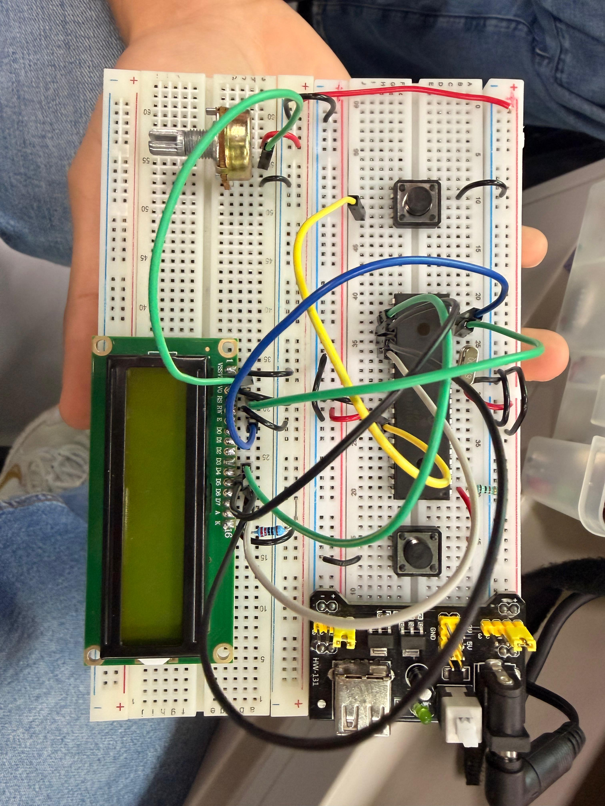

# Actividad 1 — Lectura de potenciómetro con LCD y botón

## Descripción

En esta actividad se utilizó el microcontrolador **PIC16F887** para leer el valor analógico de un potenciómetro mediante el módulo **ADC**. El valor leído se muestra en una pantalla **LCD 16x2** de dos formas diferentes: como voltaje y como porcentaje.

El circuito incluye un botón conectado al pin `RB0`, el cual permite cambiar el modo de visualización. Cuando el botón no ha cambiado el modo, la pantalla muestra el voltaje correspondiente a la posición del potenciómetro. Al presionar el botón, la pantalla cambia y muestra el porcentaje equivalente del potenciómetro.

Esta práctica permitió integrar el uso de entradas analógicas, conversión ADC, pantalla LCD, botón de control y manejo de formatos numéricos en lenguaje C.

---

## Componentes utilizados

* PIC16F887
* Pantalla LCD 16x2
* Potenciómetro
* Botón
* Resistencias para el botón
* Potenciómetro para contraste del LCD
* Cristal oscilador
* Botón de reset
* Resistencia para MCLR
* Fuente Vcc
* Tierra GND
* MPLAB X IDE
* Compilador XC8
* Proteus Design Suite
* Librería `lcd.h`

---

## Evidencias

### Simulación en Proteus

[](./evidencias_fisicas/simu_volt.mp4)

---

## Evidencias físicas

Además de la simulación en Proteus, la práctica puede implementarse físicamente utilizando el microcontrolador **PIC16F887**, una pantalla LCD 16x2, un potenciómetro y un botón.

### Armado general del circuito



### Funcionamiento físico

El siguiente GIF muestra una vista previa del funcionamiento físico. Al dar clic sobre el GIF, se abre el video completo de la evidencia.

[](./evidencias_fisicas/video_fisico.mp4)

### Carpeta completa de evidencias físicas

[Ver evidencias físicas](./evidencias_fisicas)

---

## Funcionamiento del circuito

El potenciómetro se conecta a una entrada analógica del microcontrolador, en este caso al canal `AN0`. Dependiendo de la posición del potenciómetro, el voltaje de entrada cambia entre 0 V y 5 V.

El módulo ADC del PIC16F887 convierte ese voltaje analógico en un valor digital de 10 bits, por lo que el resultado puede variar entre `0` y `1023`.

El programa utiliza ese valor para calcular dos magnitudes:

* Voltaje del potenciómetro.
* Porcentaje equivalente de la posición del potenciómetro.

El botón conectado a `RB0` permite alternar entre ambos modos de visualización. Debido a que se utilizan resistencias pull-up internas, el botón trabaja con lógica invertida: cuando no está presionado se lee `1`, y cuando se presiona se lee `0`.

---

## Lógica de programación

Primero se inicializa el módulo ADC. Se configura `AN0` como entrada analógica y el resto de canales analógicos se desactivan:

```c
void ADC_Init(){
    ANSEL = 0x01;
    ANSELH = 0x00;
    
    ADCON0 = 0x81;
    ADCON1 = 0x80;
}
```

La función `ADC_Read()` inicia la conversión analógica-digital, espera a que termine y regresa el resultado de 10 bits:

```c
unsigned int ADC_Read(){
    __delay_us(5);
    GO_nDONE = 1;
    while(GO_nDONE);
    return((ADRESH << 8) + ADRESL);
}
```

Después se configura el botón conectado a `RB0` como entrada y se habilita su resistencia pull-up interna:

```c
TRISBbits.TRISB0 = 1;
OPTION_REGbits.nRBPU = 0;
WPUBbits.WPUB0 = 1;
```

La pantalla LCD se inicializa usando el puerto C:

```c
LCD lcd = {&PORTC, 2, 3, 4, 5, 6, 7};
LCD_Init(lcd);
```

Dentro del ciclo principal, el programa revisa si el botón fue presionado. Si detecta una pulsación válida, cambia el valor de la variable `modo`:

```c
if(PORTBbits.RB0 == 0 && estado_anterior == 1){
    __delay_ms(50);
    
    if(PORTBbits.RB0 == 0){
        modo = !modo;
        
        while(PORTBbits.RB0 == 0);
        __delay_ms(50);
    }
}
```

Cuando `modo` vale `0`, se calcula y muestra el voltaje:

```c
unsigned long volt = ((unsigned long)adc_result * 50000) / 1023;
unsigned int part_int = volt / 10000;
unsigned int part_dec = volt % 10000;

LCD_putrs("Voltaje:");
LCD_Set_Cursor(1,0);
sprintf(buffer, "%u.%04u V", part_int, part_dec);
LCD_putrs(buffer);
```

Cuando `modo` vale `1`, se calcula y muestra el porcentaje:

```c
unsigned int porcentaje = ((unsigned long)adc_result * 100) / 1023;

LCD_putrs("Porcentaje:");
LCD_Set_Cursor(1,0);
sprintf(buffer, "%u %%", porcentaje);
LCD_putrs(buffer);
```

---

## Código utilizado

```c
#include <xc.h>
#include <stdio.h>
#include <stdlib.h>
#include <stdbool.h>
#include "lcd.h"

//=============================================================================
// CONFIGURACIÓN DE BITS DE CONFIGURACIÓN
//=============================================================================

#pragma config FOSC = HS        // Oscilador HS
#pragma config WDTE = OFF       // Watchdog Timer desactivado
#pragma config PWRTE = OFF      // Power-up Timer desactivado
#pragma config BOREN = ON       // Brown-out Reset activado
#pragma config LVP = OFF        // Programación en bajo voltaje desactivada
#pragma config CPD = OFF        // Protección EEPROM desactivada
#pragma config WRT = OFF        // Escritura en memoria Flash desactivada
#pragma config CP = OFF         // Protección de código desactivada

//=============================================================================
// DEFINICIONES
//=============================================================================

#define _XTAL_FREQ 8000000      // Frecuencia del oscilador

//=============================================================================
// FUNCIÓN DE INICIALIZACIÓN DEL ADC
//=============================================================================

void ADC_Init(){

    ANSEL = 0x01;       // AN0 como entrada analógica
    ANSELH = 0x00;      // Desactiva canales analógicos altos
    
    ADCON0 = 0x81;      // Activa ADC y selecciona canal AN0
    ADCON1 = 0x80;      // Justificación derecha y referencia VDD/VSS
}

//=============================================================================
// FUNCIÓN DE LECTURA DEL ADC
//=============================================================================

unsigned int ADC_Read(){

    __delay_us(5);              // Tiempo de adquisición
    GO_nDONE = 1;               // Inicia conversión ADC

    while(GO_nDONE);            // Espera a que termine la conversión

    return((ADRESH << 8) + ADRESL);  // Regresa resultado de 10 bits
}

//=============================================================================
// PROGRAMA PRINCIPAL
//=============================================================================

void main(void){

    ADC_Init();                 // Inicializa módulo ADC
    
    TRISAbits.TRISA0 = 1;       // RA0/AN0 como entrada para potenciómetro

    TRISBbits.TRISB0 = 1;       // RB0 como entrada para botón
    OPTION_REGbits.nRBPU = 0;   // Habilita pull-ups internos de PORTB
    WPUBbits.WPUB0 = 1;         // Habilita pull-up interno en RB0

    TRISC = 0x00;               // PORTC como salida para LCD
    PORTC = 0x00;
    
    LCD lcd = {&PORTC, 2, 3, 4, 5, 6, 7};    // Configuración de pines LCD
    LCD_Init(lcd);                           // Inicializa LCD
    
    char buffer[16];                 // Arreglo para guardar texto formateado
    unsigned char modo = 0;          // 0 = voltaje, 1 = porcentaje
    unsigned char estado_anterior = 1; // Guarda estado anterior del botón
    
    while(1){
        
        //---------------------------------------------------------------------
        // Lectura del botón para cambiar de modo
        //---------------------------------------------------------------------

        if(PORTBbits.RB0 == 0 && estado_anterior == 1){
            __delay_ms(50);          // Antirrebote
            
            if(PORTBbits.RB0 == 0){

                modo = !modo;        // Cambia entre voltaje y porcentaje
                
                while(PORTBbits.RB0 == 0); // Espera a que se suelte el botón
                __delay_ms(50);            // Antirrebote al soltar
            }
        }
        
        estado_anterior = PORTBbits.RB0;
        
        //---------------------------------------------------------------------
        // Lectura del ADC
        //---------------------------------------------------------------------

        unsigned int adc_result = ADC_Read();
        
        LCD_Clear();
        LCD_Set_Cursor(0,0);
        
        //---------------------------------------------------------------------
        // Modo 0: mostrar voltaje
        //---------------------------------------------------------------------

        if(modo == 0){

            unsigned long volt = ((unsigned long)adc_result * 50000) / 1023;
            unsigned int part_int = volt / 10000;
            unsigned int part_dec = volt % 10000;
            
            LCD_putrs("Voltaje:");
            LCD_Set_Cursor(1,0);
            sprintf(buffer, "%u.%04u V", part_int, part_dec);
            LCD_putrs(buffer);
        }

        //---------------------------------------------------------------------
        // Modo 1: mostrar porcentaje
        //---------------------------------------------------------------------

        else{

            unsigned int porcentaje = ((unsigned long)adc_result * 100) / 1023;
            
            LCD_putrs("Porcentaje:");
            LCD_Set_Cursor(1,0);
            sprintf(buffer, "%u %%", porcentaje);
            LCD_putrs(buffer);
        }
        
        __delay_ms(200);     // Retardo para estabilidad visual en LCD
    }
}
```

---

## Resultado esperado

Al ejecutar la simulación, la pantalla LCD debe mostrar inicialmente el voltaje correspondiente a la posición del potenciómetro.

Ejemplo:

```text
Voltaje:
2.5347 V
```

Al presionar el botón, la pantalla debe cambiar al modo porcentaje.

Ejemplo:

```text
Porcentaje:
50 %
```

Cada vez que se presiona nuevamente el botón, el sistema alterna entre mostrar el voltaje y mostrar el porcentaje del potenciómetro.

---

## Conclusión

Esta actividad permitió comprender el uso del módulo ADC del PIC16F887 para leer una señal analógica proveniente de un potenciómetro. Además, se integró el uso de una pantalla LCD 16x2 para mostrar información numérica y un botón para cambiar entre modos de visualización. La práctica reforzó conceptos como conversión analógica-digital, uso de entradas digitales, antirrebote, formato de texto y despliegue de datos en LCD.
