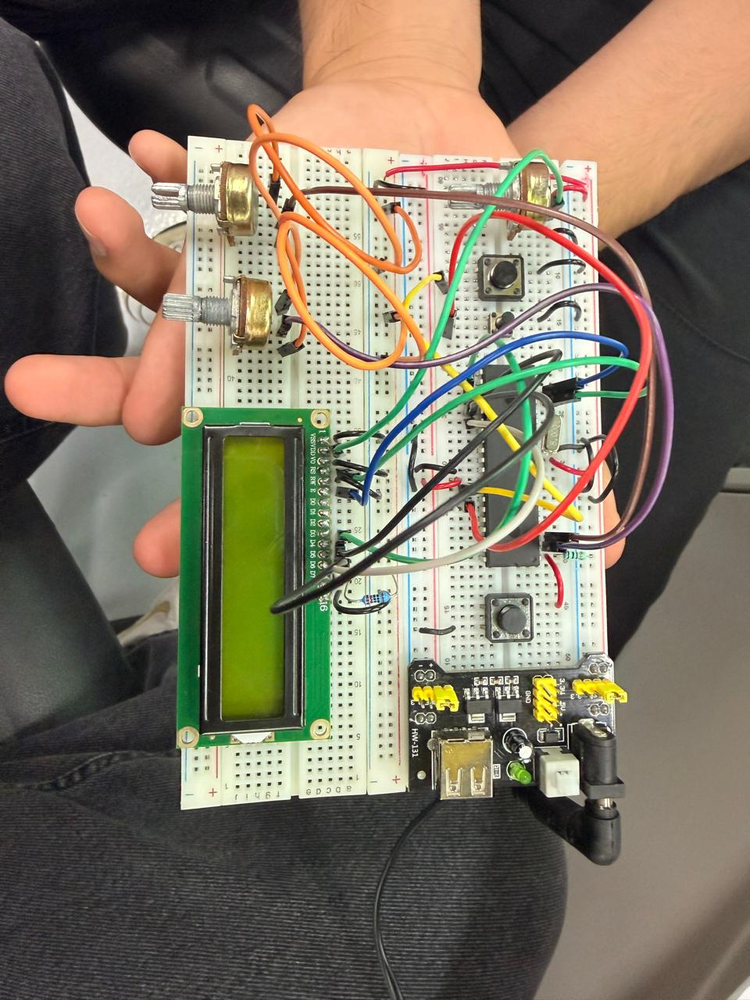

# Actividad 1 — Dos potenciómetros con modos de visualización en LCD

## Descripción

En esta actividad se utilizó el microcontrolador **PIC16F887** para leer dos potenciómetros mediante el módulo **ADC** y mostrar sus valores en una pantalla **LCD 16x2**.

El sistema permite seleccionar cuál potenciómetro se desea visualizar y también permite cambiar el tipo de dato mostrado. Mediante botones, el usuario puede alternar entre:

* Voltaje
* Porcentaje
* Valor ADC

Esta práctica permitió integrar lectura de dos canales analógicos, pantalla LCD, botones como entradas digitales, cambio de modos y visualización de datos en diferentes formatos.

---

## Componentes utilizados

* PIC16F887
* Pantalla LCD 16x2
* 2 potenciómetros
* 2 botones
* Potenciómetro para ajuste de contraste del LCD
* Resistencias para botones
* Cristal oscilador
* Botón de reset
* Resistencia para MCLR
* Fuente Vcc
* Tierra GND
* MPLAB X IDE
* Compilador XC8
* Proteus Design Suite
* Librería `lcdd.h`

---

## Evidencias

### Simulación en Proteus

[](./evidencias_fisicas/simu_volt2.mp4)

---

## Evidencias físicas

Además de la simulación en Proteus, la práctica puede implementarse físicamente utilizando el microcontrolador **PIC16F887**, una pantalla LCD 16x2, dos potenciómetros y dos botones.

### Armado general del circuito



### Funcionamiento físico

[](./evidencias_fisicas/fisico_volt2.mp4)

### Carpeta completa de evidencias físicas

[Ver evidencias físicas](./evidencias_fisicas)

---

## Funcionamiento del circuito

El circuito utiliza dos potenciómetros conectados a los canales analógicos `AN0` y `AN1` del PIC16F887. Cada potenciómetro entrega un voltaje variable entre 0 V y 5 V, dependiendo de su posición.

El microcontrolador convierte ese voltaje analógico en un valor digital mediante el módulo ADC. Como el ADC es de 10 bits, el valor obtenido puede variar entre `0` y `1023`.

El sistema utiliza dos botones:

| Botón   | Entrada | Función                       |
| ------- | ------- | ----------------------------- |
| Botón 1 | RB0     | Cambiar modo de visualización |
| Botón 2 | RB1     | Cambiar canal o potenciómetro |

El botón conectado a `RB0` cambia entre los modos:

| Modo | Dato mostrado |
| ---- | ------------- |
| 0    | Voltaje       |
| 1    | Porcentaje    |
| 2    | Valor ADC     |

El botón conectado a `RB1` cambia entre el canal `AN0` y el canal `AN1`, permitiendo visualizar el valor del primer o segundo potenciómetro.

---

## Lógica de programación

Primero se inicializa el módulo ADC, habilitando los canales `AN0` y `AN1`:

```c
void ADC_Init(){
    ANSEL = 0x03;
    ANSELH = 0x00;
    
    ADCON0 = 0x01;
    ADCON1 = 0x80;
}
```

La función `ADC_Read()` recibe el canal que se desea leer. Primero limpia la selección de canal anterior, después selecciona el nuevo canal y finalmente realiza la conversión ADC:

```c
unsigned int ADC_Read(unsigned char channel){
    ADCON0 &= 0xC3;
    ADCON0 |= channel << 2;
    
    __delay_ms(2);
    
    GO_nDONE = 1;
    while(GO_nDONE);
    
    return ((ADRESH << 8) + ADRESL);
}
```

Después se configuran los botones `RB0` y `RB1` como entradas digitales y se habilitan sus resistencias pull-up internas:

```c
TRISBbits.TRISB0 = 1;
TRISBbits.TRISB1 = 1;

OPTION_REGbits.nRBPU = 0;
WPUBbits.WPUB0 = 1;
WPUBbits.WPUB1 = 1;
```

El botón en `RB0` cambia el modo de visualización:

```c
if(PORTBbits.RB0 == 0){
    __delay_ms(50);
    if(PORTBbits.RB0 == 0){
        modo++;
        
        if(modo > 2){
            modo = 0;
        }
        
        while(PORTBbits.RB0 == 0);
    }
}
```

El botón en `RB1` cambia el canal que se desea leer:

```c
if(PORTBbits.RB1 == 0){
    __delay_ms(50);
    if(PORTBbits.RB1 == 0){
        canal++;
        
        if(canal > 1){
            canal = 0;
        }
        
        while(PORTBbits.RB1 == 0);
    }
}
```

Después se realiza la lectura ADC del canal seleccionado:

```c
adc_result = ADC_Read(canal);
```

A partir del valor ADC se calcula el voltaje y el porcentaje:

```c
volt = ((unsigned long)adc_result * 50000) / 1023;
part_ent = volt / 10000;
part_dec = volt % 10000;

porcentaje = ((unsigned long)adc_result * 100) / 1023;
```

Finalmente, dependiendo del modo seleccionado, se muestra en la LCD el voltaje, el porcentaje o el valor ADC.

---

## Código utilizado

```c
#include <xc.h>
#include <stdio.h>
#include <stdlib.h>
#include <stdbool.h>
#include "lcdd.h"

//=============================================================================
// CONFIGURACIÓN DE BITS DE CONFIGURACIÓN
//=============================================================================

#pragma config FOSC = HS        // Oscilador HS
#pragma config WDTE = OFF       // Watchdog Timer desactivado
#pragma config PWRTE = OFF      // Power-up Timer desactivado
#pragma config BOREN = ON       // Brown-out Reset activado
#pragma config LVP = OFF        // Programación en bajo voltaje desactivada
#pragma config CPD = OFF        // Protección EEPROM desactivada
#pragma config WRT = OFF        // Escritura en memoria Flash desactivada
#pragma config CP = OFF         // Protección de código desactivada

//=============================================================================
// DEFINICIONES
//=============================================================================

#define _XTAL_FREQ 8000000      // Frecuencia del oscilador

//=============================================================================
// INICIALIZACIÓN DEL ADC
//=============================================================================

void ADC_Init(){
    ANSEL = 0x03;       // Habilita AN0 y AN1 como entradas analógicas
    ANSELH = 0x00;      // Desactiva canales analógicos altos
    
    ADCON0 = 0x01;      // Enciende el ADC
    ADCON1 = 0x80;      // Justificación derecha, VDD y VSS como referencias
}

//=============================================================================
// LECTURA DE CANAL ADC
//=============================================================================

unsigned int ADC_Read(unsigned char channel){
    ADCON0 &= 0xC3;             // Limpia bits de selección de canal
    ADCON0 |= channel << 2;     // Selecciona canal ADC
    
    __delay_ms(2);              // Tiempo de adquisición
    
    GO_nDONE = 1;               // Inicia conversión
    while(GO_nDONE);            // Espera a que termine
    
    return ((ADRESH << 8) + ADRESL); // Regresa resultado de 10 bits
}

//=============================================================================
// PROGRAMA PRINCIPAL
//=============================================================================

void main(void){

    LCD lcd = {&PORTC, 2, 3, 4, 5, 6, 7};   // Configuración de pines LCD
    
    char buffer[16];                         // Arreglo para mostrar texto en LCD
    
    unsigned int adc_result;                 // Resultado ADC
    unsigned long volt;                      // Voltaje escalado
    unsigned int part_ent;                   // Parte entera del voltaje
    unsigned int part_dec;                   // Parte decimal del voltaje
    unsigned int porcentaje;                 // Porcentaje calculado
    
    unsigned char modo = 0;                  // 0 = voltaje, 1 = porcentaje, 2 = ADC
    unsigned char canal = 0;                 // 0 = AN0, 1 = AN1
    
    ADC_Init();                              // Inicializa ADC
    
    TRISAbits.TRISA0 = 1;                    // RA0/AN0 como entrada
    TRISAbits.TRISA1 = 1;                    // RA1/AN1 como entrada
    
    TRISBbits.TRISB0 = 1;                    // RB0 como botón de modo
    TRISBbits.TRISB1 = 1;                    // RB1 como botón de canal
    
    OPTION_REGbits.nRBPU = 0;                // Habilita pull-ups internos de PORTB
    WPUBbits.WPUB0 = 1;                      // Pull-up en RB0
    WPUBbits.WPUB1 = 1;                      // Pull-up en RB1
    
    TRISC = 0x00;                            // PORTC como salida para LCD
    PORTC = 0x00;
    
    LCD_Init(lcd);                           // Inicializa LCD
    
    while(1){
        
        //---------------------------------------------------------------------
        // Botón RB0: cambiar modo de visualización
        //---------------------------------------------------------------------

        if(PORTBbits.RB0 == 0){
            __delay_ms(50);                  // Antirrebote

            if(PORTBbits.RB0 == 0){
                modo++;
                
                if(modo > 2){
                    modo = 0;
                }
                
                while(PORTBbits.RB0 == 0);   // Espera a soltar botón
            }
        }
        
        //---------------------------------------------------------------------
        // Botón RB1: cambiar canal ADC
        //---------------------------------------------------------------------

        if(PORTBbits.RB1 == 0){
            __delay_ms(50);                  // Antirrebote

            if(PORTBbits.RB1 == 0){
                canal++;
                
                if(canal > 1){
                    canal = 0;
                }
                
                while(PORTBbits.RB1 == 0);   // Espera a soltar botón
            }
        }
        
        //---------------------------------------------------------------------
        // Lectura del potenciómetro seleccionado
        //---------------------------------------------------------------------

        adc_result = ADC_Read(canal);
        
        //---------------------------------------------------------------------
        // Cálculos de voltaje y porcentaje
        //---------------------------------------------------------------------

        volt = ((unsigned long)adc_result * 50000) / 1023;
        part_ent = volt / 10000;
        part_dec = volt % 10000;
        
        porcentaje = ((unsigned long)adc_result * 100) / 1023;
        
        //---------------------------------------------------------------------
        // Mostrar información en LCD
        //---------------------------------------------------------------------

        LCD_Clear();
        
        LCD_Set_Cursor(0,0);
        
        if(canal == 0){
            LCD_putrs("Voltaje 1");
        }
        else{
            LCD_putrs("Voltaje 2");
        }
        
        LCD_Set_Cursor(1,0);
        
        if(modo == 0){
            sprintf(buffer, "V: %u.%04u", part_ent, part_dec);
            LCD_putrs(buffer);
        }
        else if(modo == 1){
            sprintf(buffer, "Porcentaje:%u%%", porcentaje);
            LCD_putrs(buffer);
        }
        else{
            sprintf(buffer, "ADC: %u", adc_result);
            LCD_putrs(buffer);
        }
        
        __delay_ms(150);     // Retardo para estabilidad visual
    }
}
```

---

## Resultado esperado

Al ejecutar la simulación, la pantalla LCD debe mostrar inicialmente la lectura del primer potenciómetro. El botón conectado a `RB1` permite cambiar entre **Voltaje 1** y **Voltaje 2**.

El botón conectado a `RB0` permite cambiar el tipo de información mostrada:

```text
V: 2.5000
Porcentaje:50%
ADC: 512
```

De esta manera, el sistema permite observar la misma lectura analógica representada como voltaje, porcentaje o valor ADC.

---

## Conclusión

Esta actividad permitió ampliar el uso del módulo ADC del PIC16F887 al trabajar con dos canales analógicos. También se reforzó el uso de botones para cambiar estados dentro del programa, el manejo de una pantalla LCD 16x2 y la conversión de valores ADC a diferentes representaciones numéricas.
