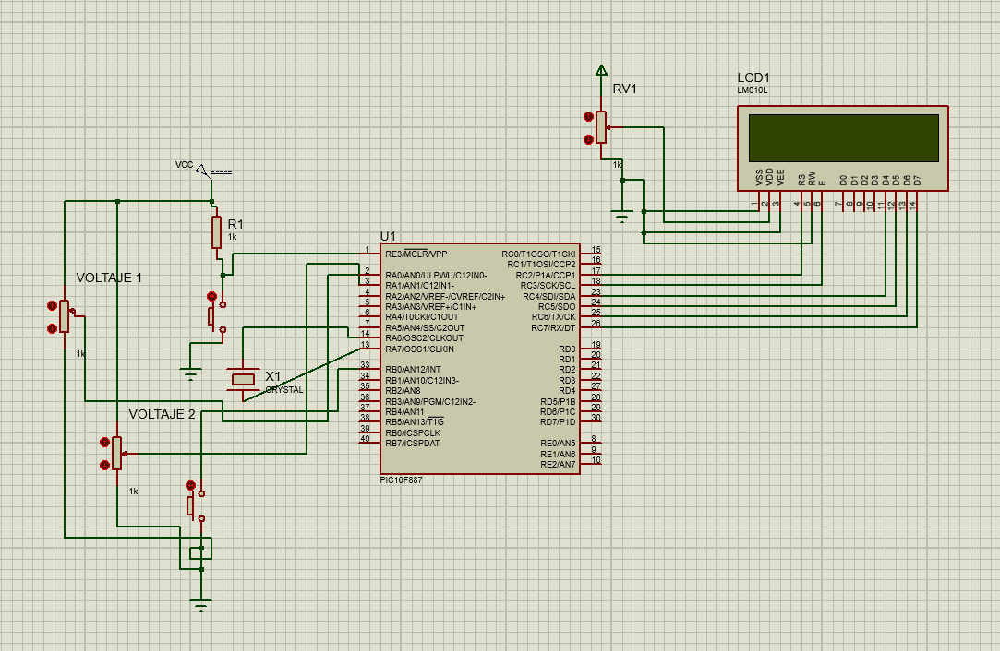

# Actividad en clase — Lectura de dos voltajes con LCD

## Descripción

En esta actividad se utilizó el microcontrolador **PIC16F887** para realizar la lectura de **dos voltajes analógicos** mediante dos potenciómetros conectados a entradas analógicas del microcontrolador.

El objetivo principal fue utilizar el módulo **ADC** para convertir las señales analógicas de ambos potenciómetros en valores digitales, y posteriormente mostrar la información en una pantalla **LCD 16x2**.

Esta práctica permitió reforzar el uso de entradas analógicas, conversión analógica-digital, lectura de más de un canal ADC y visualización de datos en una pantalla LCD.

---

## Componentes utilizados

* PIC16F887
* Pantalla LCD 16x2
* 2 potenciómetros
* Potenciómetro para ajuste de contraste del LCD
* Cristal oscilador
* Botón de reset
* Resistencia para MCLR
* Fuente Vcc
* Tierra GND
* MPLAB X IDE
* Compilador XC8
* Proteus Design Suite
* Librería LCD

---

## Evidencias

### Simulación en Proteus

[](./evidencias_fisicas/simulación_proteus.mp4)

---

## Evidencias físicas

Además de la simulación en Proteus, la práctica puede implementarse físicamente utilizando el microcontrolador **PIC16F887**, una pantalla LCD 16x2 y dos potenciómetros.

### Armado general del circuito


### Carpeta completa de evidencias físicas

[Ver evidencias físicas](./evidencias_fisicas)

---

## Funcionamiento del circuito

El circuito utiliza dos potenciómetros conectados a entradas analógicas del microcontrolador. Cada potenciómetro entrega un voltaje variable dependiendo de la posición de su perilla.

El PIC16F887 convierte estos voltajes analógicos en valores digitales mediante el módulo ADC. Posteriormente, el programa calcula el voltaje correspondiente y lo muestra en la pantalla LCD.

La pantalla LCD permite visualizar ambos valores de manera ordenada, por ejemplo:

```text
Voltaje 1: 2.50V
Voltaje 2: 4.10V
```

---

## Lógica de programación

La lógica general de esta actividad consiste en inicializar el módulo ADC, leer dos canales analógicos y mostrar los voltajes obtenidos en la pantalla LCD.

Primero se configuran dos canales analógicos, por ejemplo `AN0` y `AN1`, para leer los dos potenciómetros. Después, el programa realiza la conversión ADC de cada canal.

Cada valor ADC se convierte a voltaje usando una relación proporcional, tomando en cuenta que el ADC del PIC16F887 es de 10 bits, por lo que su rango va de `0` a `1023`.

La fórmula utilizada es:

```text
Voltaje = ADC * 5.0 / 1023
```

Finalmente, los valores calculados se muestran en la pantalla LCD.

---

## Código utilizado

```c
#include <xc.h>
#include <stdio.h>
#include <stdlib.h>
#include <stdbool.h>
#include "lcd.h"

#pragma config FOSC = HS
#pragma config WDTE = OFF
#pragma config PWRTE = OFF
#pragma config BOREN = ON
#pragma config LVP = OFF
#pragma config CPD = OFF
#pragma config WRT = OFF
#pragma config CP = OFF

#define _XTAL_FREQ 8000000

void ADC_Init(){
    ANSEL = 0x03;      // Activa AN0 y AN1 como entradas analogicas
    ANSELH = 0x00;    // Desactiva analogicas altas
    
    ADCON0 = 0x81;    // ADC encendido, canal AN0 inicialmente
    ADCON1 = 0x80;    // Justificado a la derecha, Vref = VDD y VSS
}

unsigned int ADC_Read(unsigned char canal){
    ADCON0 = (canal << 2) | 0x01;   // Selecciona canal y enciende ADC
    __delay_us(20);                 // Tiempo de adquisicion
    
    GO_nDONE = 1;                   // Inicia conversion
    while(GO_nDONE);                // Espera a que termine
    
    return((ADRESH << 8) + ADRESL); // Regresa valor de 0 a 1023
}

void MostrarVoltaje(unsigned int adc_result){
    char buffer[16];
    
    unsigned long volt = ((unsigned long)adc_result * 50000) / 1023;
    unsigned int part_int = volt / 10000;
    unsigned int part_dec = volt % 10000;
    
    sprintf(buffer, "%u.%04u", part_int, part_dec);
    LCD_putrs(buffer);
}

void main(void){
    ADC_Init();
    
    LCD lcd = {&PORTC, 2, 3, 4, 5, 6, 7};
    LCD_Init(lcd);
    
    unsigned int adc1;
    unsigned int adc2;
    
    while(1){
        adc1 = ADC_Read(0);   // Lee RA0 / AN0
        adc2 = ADC_Read(1);   // Lee RA1 / AN1
        
        LCD_Clear();
        
        LCD_Set_Cursor(0,0);
        LCD_putrs("V1:");
        LCD_Set_Cursor(0,3);
        MostrarVoltaje(adc1);
        
        LCD_Set_Cursor(1,0);
        LCD_putrs("V2:");
        LCD_Set_Cursor(1,3);
        MostrarVoltaje(adc2);
        
        __delay_ms(300);
    }
}
```

---

## Resultado esperado

Al ejecutar la simulación, la pantalla LCD debe mostrar los voltajes correspondientes a la posición de ambos potenciómetros. Al mover cada potenciómetro, el valor mostrado en la LCD debe cambiar proporcionalmente.

---

## Conclusión

Esta actividad permitió comprender cómo leer más de una señal analógica utilizando el ADC del PIC16F887. También se reforzó el uso de la pantalla LCD para mostrar variables numéricas y el manejo de distintos canales analógicos dentro de un mismo programa.
