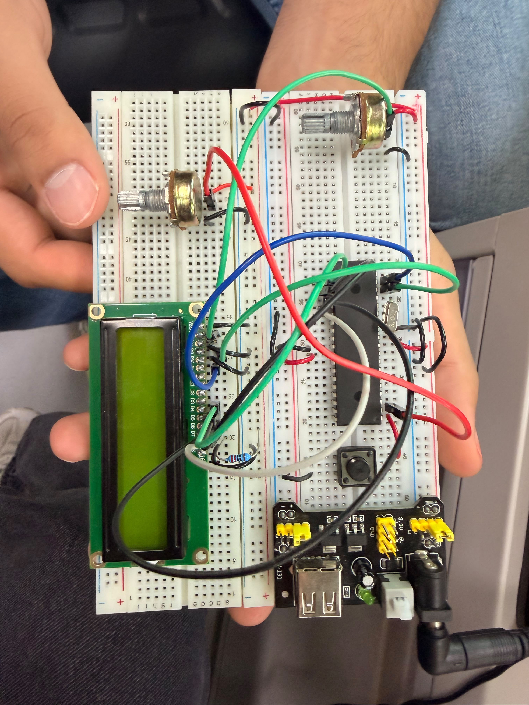

# Actividad 1 — Timer0 con monitoreo de voltaje en LCD

## Descripción

En esta actividad se integró el uso del **Timer0**, el módulo **ADC** y una pantalla **LCD 16x2**. El sistema muestra el voltaje leído desde un potenciómetro conectado a `RA0/AN0` y, al mismo tiempo, muestra un temporizador en formato `MM:SS`.

El objetivo fue combinar temporización por interrupciones con lectura analógica y despliegue de información en LCD.

---

## Componentes utilizados

- PIC16F887
- Pantalla LCD 16x2
- Potenciómetro
- Potenciómetro para contraste del LCD
- Cristal oscilador
- Botón de reset
- Resistencia para MCLR
- Fuente Vcc
- Tierra GND
- MPLAB X IDE
- Compilador XC8
- Proteus Design Suite
- Librería LCD

---

## Librería utilizada

Para el manejo de la pantalla LCD se utilizó la librería general del repositorio:

- [`lcd.h`](../../Libreria_LCD/lcd.h)
- [`lcd.c`](../../Libreria_LCD/lcd.c)

---

## Evidencias

### Simulación en Proteus

[](./evidencias_fisicas/Timer0volt_sim.mp4)

## Evidencias físicas

### Armado general del circuito 
 

### Video de funcionamiento físico 
[](./evidencias_fisicas/Timer0volt_fisico.mp4)


---

## Funcionamiento del programa

El potenciómetro conectado a `AN0` genera un voltaje variable entre 0 V y 5 V. El ADC convierte ese voltaje en un valor digital de 10 bits, con un rango de `0` a `1023`.

Al mismo tiempo, Timer0 genera interrupciones periódicas que actualizan el tiempo transcurrido. La LCD muestra el voltaje en la primera línea y el temporizador en la segunda línea.

---

## Lógica de programación

El ADC se inicializa para leer `AN0`:

```c
ANSEL = 0x01;
ADCON0 = 0x81;
ADCON1 = 0x80;
```

El voltaje se calcula en milivolts:

```c
voltaje_mV = ((unsigned long)adc * 5000) / 1023;
```

Timer0 actualiza el tiempo dentro de la interrupción:

```c
if(contador >= 100){
    tiempo++;
    contador = 0;
}
```

Para evitar errores mientras la interrupción modifica el tiempo, el programa copia el valor de `tiempo` con interrupciones desactivadas:

```c
GIE = 0;
segundos = tiempo;
GIE = 1;
```

---

## Código utilizado

```c
#include <xc.h>
#include <stdio.h>
#include <stdlib.h>
#include <stdbool.h>
#include "lcd.h"

//=============================================================================
// CONFIGURACIÓN DE BITS
//=============================================================================

#pragma config FOSC = HS
#pragma config WDTE = OFF
#pragma config PWRTE = OFF
#pragma config BOREN = ON
#pragma config LVP = OFF
#pragma config CPD = OFF
#pragma config WRT = OFF
#pragma config CP = OFF

#define _XTAL_FREQ 8000000

volatile unsigned int tiempo = 0;
volatile unsigned int contador = 0;

char bufferVoltaje[16];
char bufferTiempo[6];

//=============================================================================
// CONFIGURACIÓN ADC
//=============================================================================

void ADC_Init(){
    ANSEL = 0x01;              // AN0 como analógico
    ANSELH = 0x00;             // Los demás analógicos apagados

    TRISAbits.TRISA0 = 1;      // RA0 como entrada

    ADCON0 = 0x81;             // ADC encendido, canal AN0
    ADCON1 = 0x80;             // Justificado a la derecha, Vref = VDD y VSS
}

unsigned int ADC_Read(){
    __delay_us(20);

    GO_nDONE = 1;
    while(GO_nDONE);

    return ((ADRESH << 8) + ADRESL);
}

//=============================================================================
// CONFIGURACIÓN TIMER0
//=============================================================================

void Timer0_Init(){
    OPTION_REG = 0x07;     // Timer0 con prescaler 1:256
    TMR0 = 178;

    T0IE = 1;              // Habilita interrupción Timer0
    GIE = 1;               // Habilita interrupciones globales
}

void __interrupt() ISR(void){
    if(T0IF){
        contador++;

        if(contador >= 100){
            tiempo++;
            contador = 0;
        }

        TMR0 = 178;
        T0IF = 0;
    }
}

//=============================================================================
// PROGRAMA PRINCIPAL
//=============================================================================

void main(void){
    unsigned int adc;
    unsigned int voltaje_mV;
    unsigned int segundos;

    ADC_Init();
    Timer0_Init();

    LCD lcd = {&PORTC, 2, 3, 4, 5, 6, 7};
    LCD_Init(lcd);

    LCD_Clear();

    while(1){
        adc = ADC_Read();

        // Conversión a milivolts usando VDD = 5V
        voltaje_mV = ((unsigned long)adc * 5000) / 1023;

        // Primera fila: voltaje
        LCD_Set_Cursor(0, 0);
        sprintf(bufferVoltaje, "Voltaje:%u.%02uV ",
                voltaje_mV / 1000,
                (voltaje_mV % 1000) / 10);

        LCD_putrs(bufferVoltaje);

        // Copiamos el tiempo para evitar errores mientras cambia en interrupción
        GIE = 0;
        segundos = tiempo;
        GIE = 1;

        // Segunda fila: timer pegado a la derecha
        LCD_Set_Cursor(1, 11);
        sprintf(bufferTiempo, "%02u:%02u", segundos / 60, segundos % 60);
        LCD_putrs(bufferTiempo);

        __delay_ms(200);
    }
}
```

---

## Resultado esperado

La pantalla LCD debe mostrar el voltaje del potenciómetro y un temporizador. Al mover el potenciómetro, el voltaje cambia mientras el tiempo continúa avanzando.

---

## Conclusión

Esta actividad permitió integrar ADC, Timer0, interrupciones y LCD en un mismo sistema. Se reforzó la conversión analógica-digital y el uso de temporización sin detener la ejecución principal.
