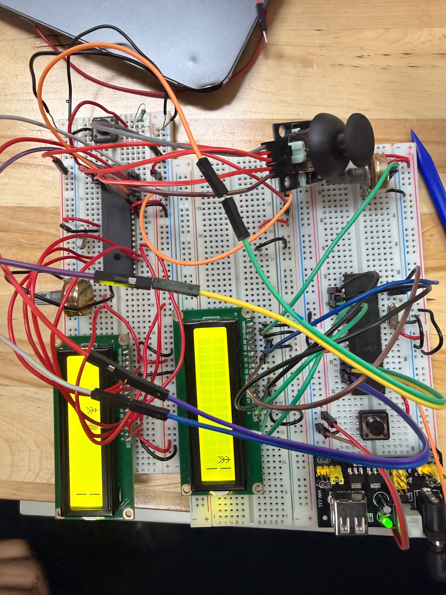

# Proyecto Final — Juego de fútbol con comunicación entre dos PIC16F887

## Descripción

En este proyecto final se integraron los conocimientos adquiridos durante el curso mediante el desarrollo de un juego de fútbol utilizando dos microcontroladores PIC16F887. El sistema se divide en dos partes: un PIC controla al delantero y el disparo del balón, mientras que el segundo PIC controla al portero y determina si el tiro termina en gol o en atajada.

El proyecto utiliza pantallas LCD 16x2, joysticks analógicos, lectura ADC, caracteres personalizados y comunicación digital entre ambos microcontroladores. La práctica funciona como una integración de entradas analógicas, entradas y salidas digitales, manejo de LCD y lógica de programación.

## Componentes utilizados

- 2 microcontroladores PIC16F887
- 2 pantallas LCD 16x2
- 2 joysticks analógicos
- Potenciómetros para contraste de LCD
- Resistencias
- Cristales osciladores
- Botones de reset
- Fuente de alimentación
- MPLAB X IDE
- Compilador XC8
- Proteus Design Suite

 ### Simulación en Proteus
 

## Funcionamiento general

El primer PIC controla al jugador delantero. Con el joystick se mueve al jugador en la pantalla LCD y, al presionar el botón del joystick, se realiza el disparo del balón.

El segundo PIC controla al portero. Este recibe la información del disparo desde el primer PIC y anima el balón en su propia pantalla LCD. Si el portero está en la misma fila que el balón, el sistema muestra una atajada. Si no coincide, se muestra gol.

## Conexiones principales

| Elemento | PIC delantero | PIC portero |
|---|---|---|
| Joystick Y | RA0 / AN0 | RA0 / AN0 |
| Joystick X | RA1 / AN1 | No aplica |
| Botón de disparo | RB0 | No aplica |
| Señal de fila del balón | RB2 | RB1 |
| Señal de tiro | RB3 | RB3 |
| Señal de atajada | RB4 | RB4 |
| Señal de gol | RB5 | RB5 |
| LCD | PORTC | PORTC |

## Archivos del proyecto

| Archivo | Descripción |
|---|---|
| `PIC_Delantero/main.c` | Código del PIC que controla al delantero y el disparo |
| `PIC_Delantero/lcdb.h` | Librería LCD del delantero |
| `PIC_Delantero/lcdb.c` | Funciones de la librería LCD del delantero |
| `PIC_Portero/main.c` | Código del PIC que controla al portero |
| `PIC_Portero/lcdp.h` | Librería LCD del portero |
| `PIC_Portero/lcdp.c` | Funciones de la librería LCD del portero |

## Evidencias

## Evidencias físicas

### Armado general del circuito 
 

### Video de funcionamiento físico 

## Conocimientos integrados

- Configuración del PIC16F887
- Lectura ADC
- Uso de joysticks analógicos
- Entradas y salidas digitales
- Manejo de LCD 16x2
- Creación de caracteres personalizados
- Comunicación entre dos microcontroladores
- Lógica de estados
- Simulación en Proteus

## Resultado esperado

El sistema permite jugar una dinámica sencilla de fútbol. El delantero puede moverse y disparar el balón, mientras el portero intenta detenerlo. Dependiendo de la posición del portero, el programa muestra si hubo gol o atajada.

## Conclusión

Este proyecto permitió aplicar de forma conjunta los temas vistos durante el curso. A diferencia de las prácticas individuales, aquí se integraron dos microcontroladores trabajando en conjunto, lectura analógica, control de LCD, comunicación digital y lógica de juego, logrando un sistema interactivo completo.
