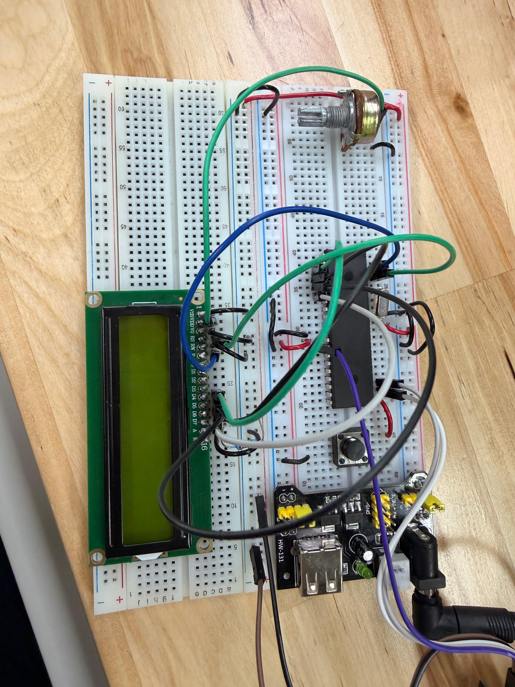

# Proyecto Unidad 1 — Videojuego en LCD controlado con joystick

## Descripción

En este proyecto se desarrolló un pequeño videojuego utilizando el microcontrolador **PIC16F887**, una pantalla **LCD 16x2**, un joystick analógico y un botón. El objetivo principal fue controlar el movimiento de un personaje personalizado dentro de la pantalla LCD.

El personaje se desplaza horizontalmente con el eje **X** del joystick y cambia de línea con el eje **Y**. Además, al presionar el botón, el personaje cambia visualmente para simular una animación.

El movimiento del personaje depende directamente de la lectura analógica del joystick, la cual se obtiene mediante el módulo **ADC** del PIC16F887.

---

## Requisitos del proyecto

De acuerdo con las indicaciones del proyecto, se debía cumplir con lo siguiente:

* Hacer un videojuego controlado con joystick.
* Mostrar el videojuego en una pantalla LCD.
* Crear un personaje personalizado.
* Controlar el movimiento del personaje con el eje X del joystick.
* Cambiar la línea del personaje con el eje Y.
* Usar un botón para que el personaje tenga una animación.
* Al llegar a un extremo de la pantalla, el personaje debe aparecer en el extremo opuesto.

---

## Componentes utilizados

* PIC16F887
* Pantalla LCD 16x2
* Joystick analógico
* Botón
* Potenciómetro para contraste del LCD
* Cristal oscilador
* Botón de reset
* Resistencia para MCLR
* Fuente Vcc
* Tierra GND
* MPLAB X IDE
* Compilador XC8
* Proteus Design Suite
* Librería `lcd.h`

---

## Evidencias

### Simulación en Proteus

[](./evidencias_fisicas/video_fisico.mp4)

---

## Evidencias físicas

Además de la simulación en Proteus, el proyecto puede implementarse físicamente utilizando el microcontrolador **PIC16F887**, una pantalla LCD 16x2, un joystick y un botón.

### Armado general del circuito



### Funcionamiento físico

El siguiente GIF muestra una vista previa del funcionamiento físico. Al dar clic sobre el GIF, se abre el video completo de la evidencia.

[](./evidencias_fisicas/fisico_proy.mp4)

### Carpeta completa de evidencias físicas

[Ver evidencias físicas](./evidencias_fisicas)

---

## Funcionamiento del circuito

El joystick funciona como dos potenciómetros internos. Uno representa el eje **X** y el otro representa el eje **Y**. Estos dos valores analógicos se conectan a los canales `AN0` y `AN1` del microcontrolador.

El PIC16F887 realiza la lectura de ambos canales mediante el módulo **ADC**. Dependiendo del valor leído en el eje X, el personaje se mueve hacia la izquierda o hacia la derecha. Si el valor del eje X es bajo, la posición disminuye; si el valor es alto, la posición aumenta.

El eje Y permite cambiar la línea del personaje en la pantalla LCD. Si el valor del eje Y es bajo, el personaje se muestra en la primera línea. Si el valor es alto, se muestra en la segunda línea.

El botón conectado a `RB0` cambia el carácter mostrado en pantalla. En esta implementación, cuando el botón no está presionado se muestra el dinosaurio, y al presionarlo se muestra una carita, simulando una animación o cambio de estado del personaje.

---

## Lógica de programación

Primero se definen dos caracteres personalizados para el LCD. El primer carácter representa un dinosaurio:

```c
unsigned char dinosaurio[8] = {
    0b00111,
    0b00101,
    0b10111,
    0b11110,
    0b11111,
    0b01110,
    0b01010,
    0b11011
};
```

El segundo carácter representa una carita:

```c
unsigned char carita[8] = {
    0b00000,
    0b01010,
    0b01010,
    0b00000,
    0b10001,
    0b01110,
    0b00000,
    0b00000
};
```

La función `ADC_Read()` permite leer el canal analógico seleccionado. En este proyecto se utilizan dos canales:

| Canal | Entrada | Función            |
| ----- | ------- | ------------------ |
| AN0   | RA0     | Eje X del joystick |
| AN1   | RA1     | Eje Y del joystick |

```c
unsigned int ADC_Read(unsigned char canal){
    ADCON0 = (canal << 2) | 0x01;
    __delay_ms(2);
    GO_nDONE = 1;
    while(GO_nDONE);
    return (ADRESH << 8) + ADRESL;
}
```

La función `CrearCaracter()` guarda un carácter personalizado en la memoria CGRAM del LCD:

```c
void CrearCaracter(unsigned char pos, unsigned char dibujo[]){
    LCD_Cmd(0x40 + (pos * 8));

    for(int i = 0; i < 8; i++){
        LCD_putc(dibujo[i]);
    }

    LCD_Cmd(0x80);
}
```

La posición inicial del personaje se establece en la columna 7 y en la línea 0:

```c
int pos = 7;
int linea = 0;
```

El eje X controla el desplazamiento horizontal:

```c
if(x < 400){
    pos--;
    __delay_ms(120);
}

if(x > 600){
    pos++;
    __delay_ms(120);
}
```

Si el personaje llega a un extremo de la pantalla, aparece en el extremo opuesto:

```c
if(pos < 0){
    pos = 15;
}

if(pos > 15){
    pos = 0;
}
```

El eje Y controla la línea donde aparece el personaje:

```c
if(y < 400){
    linea = 0;
}

if(y > 600){
    linea = 1;
}
```

Finalmente, se limpia la pantalla, se coloca el cursor en la posición actual y se muestra el personaje:

```c
LCD_Clear();
LCD_Set_Cursor(linea, pos);

if(PORTBbits.RB0 == 0){
    LCD_putc(1);
}
else{
    LCD_putc(0);
}
```

---

## Código utilizado

```c
#include <xc.h>
#include <stdio.h>
#include <stdlib.h>
#include <stdbool.h>
#include "lcd.h"

//=============================================================================
// CONFIGURACIÓN DE BITS DE CONFIGURACIÓN
//=============================================================================

#pragma config FOSC = HS        // Oscilador HS
#pragma config WDTE = OFF       // Watchdog Timer desactivado
#pragma config PWRTE = OFF      // Power-up Timer desactivado
#pragma config BOREN = ON       // Brown-out Reset activado
#pragma config LVP = OFF        // Programación en bajo voltaje desactivada
#pragma config CPD = OFF        // Protección EEPROM desactivada
#pragma config WRT = OFF        // Escritura en memoria Flash desactivada
#pragma config CP = OFF         // Protección de código desactivada

//=============================================================================
// DEFINICIONES
//=============================================================================

#define _XTAL_FREQ 8000000      // Frecuencia del oscilador

//=============================================================================
// CARACTERES PERSONALIZADOS
//=============================================================================

// Personaje principal: dinosaurio
unsigned char dinosaurio[8] = {
    0b00111,
    0b00101,
    0b10111,
    0b11110,
    0b11111,
    0b01110,
    0b01010,
    0b11011
};

// Segundo estado del personaje: carita
unsigned char carita[8] = {
    0b00000,
    0b01010,
    0b01010,
    0b00000,
    0b10001,
    0b01110,
    0b00000,
    0b00000
};

//=============================================================================
// LECTURA DEL ADC
//=============================================================================

unsigned int ADC_Read(unsigned char canal){

    ADCON0 = (canal << 2) | 0x01;    // Selecciona canal ADC y enciende el módulo
    __delay_ms(2);                   // Tiempo de adquisición

    GO_nDONE = 1;                    // Inicia conversión
    while(GO_nDONE);                 // Espera a que termine la conversión

    return (ADRESH << 8) + ADRESL;   // Regresa resultado ADC de 10 bits
}

//=============================================================================
// CREACIÓN DE CARACTERES PERSONALIZADOS
//=============================================================================

void CrearCaracter(unsigned char pos, unsigned char dibujo[]){

    LCD_Cmd(0x40 + (pos * 8));       // Selecciona posición en CGRAM

    for(int i = 0; i < 8; i++){
        LCD_putc(dibujo[i]);         // Guarda cada fila del carácter
    }

    LCD_Cmd(0x80);                   // Regresa a DDRAM
}

//=============================================================================
// PROGRAMA PRINCIPAL
//=============================================================================

void main(void){

    LCD lcd = {&PORTC, 2, 3, 4, 5, 6, 7};   // Configuración del LCD en PORTC

    //-------------------------------------------------------------------------
    // Configuración de pines digitales y analógicos
    //-------------------------------------------------------------------------

    ANSEL = 0x03;       // AN0 y AN1 como entradas analógicas
    ANSELH = 0x00;      // Desactiva canales analógicos altos
    ADCON1 = 0x80;      // Justificación derecha, VDD y VSS como referencias

    TRISA = 0x03;       // RA0 y RA1 como entradas para joystick
    TRISC = 0x00;       // PORTC como salida para LCD
    PORTC = 0x00;

    TRISBbits.TRISB0 = 1;        // RB0 como entrada para botón

    OPTION_REGbits.nRBPU = 0;    // Habilita pull-ups internos de PORTB
    WPUBbits.WPUB0 = 1;          // Habilita pull-up en RB0

    //-------------------------------------------------------------------------
    // Inicialización del LCD y caracteres personalizados
    //-------------------------------------------------------------------------

    LCD_Init(lcd);

    CrearCaracter(0, dinosaurio);    // Guarda dinosaurio en posición 0
    CrearCaracter(1, carita);        // Guarda carita en posición 1

    //-------------------------------------------------------------------------
    // Variables de posición del personaje
    //-------------------------------------------------------------------------

    int x, y;            // Lecturas ADC del joystick
    int pos = 7;         // Columna inicial del personaje
    int linea = 0;       // Línea inicial del personaje

    //-------------------------------------------------------------------------
    // Ciclo principal
    //-------------------------------------------------------------------------

    while(1){

        x = ADC_Read(0);     // Lee eje X del joystick
        y = ADC_Read(1);     // Lee eje Y del joystick

        //---------------------------------------------------------------------
        // Movimiento horizontal con eje X
        //---------------------------------------------------------------------

        if(x < 400){
            pos--;           // Mueve a la izquierda
            __delay_ms(120);
        }

        if(x > 600){
            pos++;           // Mueve a la derecha
            __delay_ms(120);
        }

        //---------------------------------------------------------------------
        // Teletransporte entre extremos
        //---------------------------------------------------------------------

        if(pos < 0){
            pos = 15;        // Si sale por la izquierda, aparece a la derecha
        }

        if(pos > 15){
            pos = 0;         // Si sale por la derecha, aparece a la izquierda
        }

        //---------------------------------------------------------------------
        // Cambio de línea con eje Y
        //---------------------------------------------------------------------

        if(y < 400){
            linea = 0;       // Primera línea del LCD
        }

        if(y > 600){
            linea = 1;       // Segunda línea del LCD
        }

        //---------------------------------------------------------------------
        // Mostrar personaje en LCD
        //---------------------------------------------------------------------

        LCD_Clear();
        LCD_Set_Cursor(linea, pos);

        if(PORTBbits.RB0 == 0){
            LCD_putc(1);     // Si se presiona el botón, muestra la carita
        }
        else{
            LCD_putc(0);     // Si no se presiona, muestra el dinosaurio
        }

        __delay_ms(80);      // Retardo para estabilidad visual
    }
}
```

---

## Resultado esperado

Al ejecutar el proyecto, la pantalla LCD debe mostrar un personaje personalizado. El joystick permite moverlo horizontalmente y cambiarlo entre la primera y segunda línea del LCD.

Cuando el personaje llega al extremo derecho, aparece nuevamente del lado izquierdo. Si llega al extremo izquierdo, aparece nuevamente del lado derecho.

Al presionar el botón, el personaje cambia visualmente, simulando una animación.

---

## Conclusión

Este proyecto permitió integrar varios conceptos vistos durante la unidad, como el uso de pantalla LCD, caracteres personalizados, lectura ADC, joystick analógico, botones y lógica de movimiento. También permitió aplicar condiciones, funciones y manejo de posición dentro de una pantalla LCD para crear una interacción tipo videojuego con el PIC16F887.
